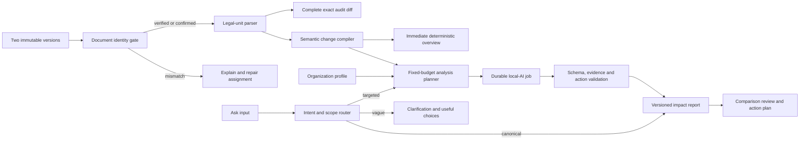

# Helvetic Lens decision-ready AI triage

**Status:** target product and architecture contract; first guardrail slice implemented

**Decision date:** 3 September 2026

**Related roadmap:** [HL-058–HL-064](../BACKLOG.md#hl-058)
**Deployment assumption:** local Apertus is the primary inference path

Helvetic Lens should reduce the time between a new official version and a defensible review decision. The useful outcome is a short, evidence-backed explanation of material legal changes, their possible relevance to an organization, and a concrete review plan. The exact line/passage diff remains available as the audit layer.

## What the current evidence showed

The observed comparison flow exposed four connected failures:

| Observation                                                                                                                   | Root cause                                                                                                                                                  | Product harm                                                                             |
| ----------------------------------------------------------------------------------------------------------------------------- | ----------------------------------------------------------------------------------------------------------------------------------------------------------- | ---------------------------------------------------------------------------------------- |
| A monitored naturalization decree was compared with artifacts identifying themselves as SR 910.13.                            | There is no hard document-identity gate before comparison and inference.                                                                                    | A polished answer can describe the wrong law.                                            |
| One Impact run sent 3,688 evidence passages through 195 local model calls and took about 8 minutes 23 seconds.                | Passage count drives inference work. The model is asked to review every low-level diff batch.                                                               | Long waits, excessive GPU use, and equal weight for noise and substance.                 |
| The vague input `Ничего не понятно но очень интересно` caused 249 sequential model calls and took about 9 minutes 34 seconds. | Every non-change question defaults to both complete versions; there is no intent/clarification gate.                                                        | A conversational phrase becomes the most expensive query and returns arbitrary excerpts. |
| Three identical next steps were displayed.                                                                                    | Local synthesis creates one action per selected batch from the same hard-coded template; actions are not deduplicated and the schema requires at least one. | The result occupies space without helping anyone decide or act.                          |

These are contract problems rather than prompt wording problems. A larger model may produce smoother prose while preserving the same bad work plan.

The current implementation now supplies the first two protective slices: a persisted and audited document-identity gate plus diff schema v6. The latter keeps a complete exact passage audit under a legal-unit hierarchy, deterministic semantic classifications, recorded match evidence, and stable amendment clusters. A bounded material-change dossier, hard five-request Impact and three-request Ask budgets that include retries and repair, zero-call clarification for vague input, and server-side action deduplication with zero actions allowed are also active. Durable jobs, richer action workflow, intent routing, the redesigned comparison workspace, and the full multilingual acceptance corpus remain roadmap work in HL-060–HL-064.

## Product contract

Every comparison should help the user complete this sequence:

1. **See the material change.** Separate changed legal meaning from layout, movement, and renumbering.
2. **Understand possible relevance.** Relate the cited change to the organization's profile and state assumptions.
3. **Choose a review action.** Offer a small, non-duplicated set of tasks with ownership and timing where the evidence supports them.
4. **Verify the conclusion.** Open the exact old/new unit and the saved original artifact.

AI performs semantic explanation, applicability triage, and review-plan drafting. Deterministic code and official connector metadata establish document identity, legal-unit alignment, exact text differences, dates, and known relationships. The model cannot replace those facts or promote a possible relationship to a confirmed one.

Free-form Ask is a drill-down after the current report. The product should answer common decisions proactively instead of making the user discover the right prompt.

## Processing architecture



All derived records are versioned and reproducible. A new extractor, matcher, profile, prompt, model, schema, or locale creates a new fingerprint and result; it never mutates the saved source version or silently rewrites history.

## 1. Document identity gate

Before comparison, the system derives an `ArtifactIdentity` for each saved artifact:

- authority and connector;
- canonical work identifier such as ELI, SR/RS number, parliamentary business ID, or court docket;
- document kind and title;
- language/expression;
- version, publication, and effective dates when supplied by the source;
- canonical and resolved URLs;
- evidence and method used to establish the identity.

The pair receives one of four states:

| State      | Meaning                                                                | Allowed behavior                                                                                                |
| ---------- | ---------------------------------------------------------------------- | --------------------------------------------------------------------------------------------------------------- |
| `verified` | Matching official canonical work and compatible expression.            | Compare and analyse automatically.                                                                              |
| `probable` | Strong non-contradictory match without a complete official identifier. | Compare with a visible identity note.                                                                           |
| `unknown`  | Evidence is insufficient.                                              | Ask an authorized user to confirm or reassign; record the decision.                                             |
| `mismatch` | Identifiers, kind, language, or content contradict the selected work.  | Quarantine automated conclusions and AI; allow exact inspection, preserve both artifacts, and explain recovery. |

AI may propose an identity for review, but only official metadata, deterministic rules, or an audited user decision can clear the gate. A title similarity score cannot overrule a different SR/RS or ELI identity.

## 2. Legal-unit and semantic change compiler

The parser builds a source-aware hierarchy such as title, chapter, section, article, paragraph, littera, and number. Every unit points back to its exact saved passages and artifact location.

Comparison-only normalization handles safe noise:

- Unicode and whitespace variants;
- page and line wrapping;
- repeated page headers/footers;
- end-of-line word hyphenation when reconstruction is unambiguous;
- numbering changes without changed body text.

Stored source text is never rewritten. Numbers, dates, negation, punctuation, and legally meaningful wording stay exact.

Unit matching uses this order:

1. official/stable identifiers;
2. normalized structural label and parent;
3. high-confidence content identity;
4. bounded neighbour and content similarity;
5. `uncertain` when no safe match exists.

The semantic layer classifies `substantive`, `added`, `removed`, `moved`, `renumbered`, `formatting_only`, and `uncertain`. A coherent amendment becomes one stable change cluster with its before/after units and context. Severity and organization applicability are later conclusions; they do not influence deterministic alignment.

The user sees material and uncertain clusters first. The complete current passage/word diff remains accessible through **All exact changes**, including every item suppressed from the default view.

## 3. Fixed-budget analysis planner

An `AnalysisPlan` is persisted before any model request. It records:

- intent and requested output;
- semantic change IDs and evidence fingerprint;
- profile, locale, prompt, schema, model, and runtime fingerprints;
- actual serialized input estimate and output reserve;
- model context limit verified on the active runtime;
- call budget and planned groups;
- complete/limited coverage and inclusion reasons.

Default budgets count every generation, including routing, repair, and synthesis:

| Work                                    |  Default maximum | Normal path                                                       |
| --------------------------------------- | ---------------: | ----------------------------------------------------------------- |
| No material/uncertain change            |                0 | Deterministic result.                                             |
| Small Impact report                     |                1 | All semantic change clusters in one request.                      |
| Large Impact report                     |                5 | Up to four coherent groups and one synthesis/repair allocation.   |
| Ask about a selected unit or comparison |                3 | Direct answer, with a repair or synthesis only if budget remains. |
| Vague/conversational input              | 0 document calls | Clarification, suggested intents, and cached TL;DR.               |

Both complete versions may be sent together when their actual serialized content, instructions, and output reserve fit the measured context window. This is useful for small documents. Large laws use the complete semantic change set for change questions and targeted saved-version evidence for other questions.

The semantic diff remains complete even when inference cannot be. If a major rewrite exceeds the fixed budget, the report states exactly how many material/uncertain units received AI review and offers analysis of a selected topic. The system never expands to one generation per passage and never calls a cloud provider because the local budget was exhausted.

## 4. Impact report contract

The validated report contains:

- a plain-language headline and materiality;
- material change insights;
- possible organization applicability and affected areas;
- detected obligations and dates, each with provenance;
- uncertainties and missing organization context;
- zero to five review actions;
- deterministic and AI coverage;
- exact provenance for the report version.

A change insight contains a stable `change_id`, before/after unit references, concise delta, affected subject, possible applicability, severity, evidence grade, assumptions, and citations.

### Severity and evidence are separate

Severity estimates possible consequence. Evidence grade describes support:

- **Confirmed:** explicit official metadata/relation or direct deterministic fact;
- **Supported:** the conclusion follows directly from cited old/new wording;
- **Possible:** a cited AI inference about relevance or effect;
- **Needs review:** identity, context, applicability, or evidence is incomplete.

A high-severity possibility may still have weak evidence. `Unknown` never becomes `Low` merely to fill a field. Model self-confidence alone does not set the displayed evidence grade.

### Review actions

Each proposed action is a structured record:

```text
action_type
verb_object_title
rationale
proposed_owner_role
affected_business_area
priority
due_basis_and_date | not_found
applicability_condition
related_change_ids
citations
action_key
```

Zero actions is valid. A report may explain a change without finding a defensible next step.

The server creates `action_key` from normalized type, object, owner role, condition, and due basis. Duplicate keys are merged and their change IDs/citations combined. Validation rejects a final report that still contains duplicate keys. An action must name an object and decision; “review the cited impact with the responsible owner” is insufficient on its own.

An authorized organization user can accept, assign, schedule, dismiss, or mark an action not applicable. Those decisions have actor/time/rationale and never modify the shared official evidence.

## 5. Ask intent and scope

The router decides intent before assembling evidence:

| Intent                | Context                                                                      |
| --------------------- | ---------------------------------------------------------------------------- |
| `explain_changes`     | Complete semantic change set and current validated report.                   |
| `organization_impact` | Semantic changes, current report, and organization profile.                  |
| `actions`             | Current report, change evidence, and existing action decisions.              |
| `specific_unit`       | Selected unit plus parent/neighbour context and relevant change.             |
| `whole_document`      | Complete versions only when they fit; otherwise explicit targeted retrieval. |
| `vague`               | No document body; cached TL;DR and clarification choices.                    |
| `off_topic`           | No legal evidence request; redirect to supported tasks.                      |

Change-related questions always use the complete semantic change set and uncertainty records. They do not use passage retrieval, so “what changed?” cannot miss a saved change because a search ranker failed to return it.

For vague input, a useful response is immediate:

> It sounds like you want a simpler explanation. I can summarize the material changes, check possible relevance to your organization, show new obligations or deadlines, or create a review checklist.

The choices become canonical, localized intents. If a current validated report exists, its short headline can appear without a new request.

The interface should only look conversational if follow-ups receive the prior validated answer and its citations. Otherwise every item is labelled as an independent saved question.

## 6. Background work, progress, and history

Impact and non-trivial Ask requests create durable jobs and return immediately. The comparison remains useful through its deterministic overview.

User-visible states come from persisted work:

1. `queued` with position/estimated wait when known;
2. `preparing_changes` with material unit count;
3. `analysing` with completed/total groups;
4. `validating_evidence`;
5. `ready`, `limited`, `failed`, or `cancelled`.

The user can navigate away, cancel queued/running work safely, and receive an in-app completion notice. Status may stream; unvalidated legal prose does not. A failed or partial attempt cannot replace the last valid current report.

History shows the current report first and older results behind **Previous analyses**. Every result retains comparison/version IDs, semantic-diff fingerprint, profile/prompt/model/runtime/schema revisions, output locale, plan, coverage, duration, call/token counts when available, validation outcome, citations, user, and timestamps.

Identical valid work returns the saved result without inference. A changed dependency creates a new result and marks the old one stale while leaving it inspectable. A semantically similar free-form question may surface a previous answer as a suggestion; it is not silently reused as an exact answer.

## 7. Target comparison experience

The page leads with a compact deterministic summary:

```text
2 Material · 1 Added/removed · 38 Moved/renumbered · 214 Formatting · 1 Needs review
```

The primary review stack is:

1. **What changed** — three to five material findings, expandable before/after units, and evidence links.
2. **Why it may matter to your organization** — applicability, affected areas, severity, evidence grade, assumptions, and important dates.
3. **Review plan** — unique actionable tasks and organization decisions.
4. **Ask about this comparison** — suggested intents, selected scope, and targeted questions.

The exact diff is a separate audit view rather than a multi-thousand-row precondition for understanding the report. A user can always move from a conclusion to the cited unit, exact word diff, saved passage, and original artifact.

All states and labels follow the five-locale contract. Product locale, source language, and AI output locale remain separate. Citations stay in the official source language; generated translation is labelled and cannot replace evidence.

## Failure behavior

| Failure                               | Product response                                                                                |
| ------------------------------------- | ----------------------------------------------------------------------------------------------- |
| Identity mismatch                     | Block comparison/AI, show both identities and repair options.                                   |
| Parser cannot align a unit            | Show `Needs review`; retain both exact sides.                                                   |
| Local model offline                   | Keep deterministic overview and queue/wait state; no cloud fallback.                            |
| Budget cannot cover a rewrite         | Mark AI coverage limited and offer topic/unit selection.                                        |
| Invalid structured result or citation | Preserve the last valid report, record failure, and show no unverified claim.                   |
| Missing organization profile          | Explain changes; label personalized applicability unavailable and avoid generic filler actions. |
| No supported action or deadline       | Return zero actions or `not_found`; never invent one.                                           |

## Release evidence

Public-beta acceptance requires a labelled multilingual regression corpus with:

- different-law identity mismatch;
- formatting/page-wrap and split-word noise;
- one inserted provision followed by mass renumbering;
- a moved unchanged section;
- one real obligation or deadline change;
- explicit repeal/replacement metadata;
- a large rewritten document.

Required outcomes:

- the identity mismatch cannot start comparison or AI;
- the insertion fixture shows the intended material change and groups consequent renumbering separately;
- exact audit coverage remains complete;
- a 1,400-plus-passage or 3,600-plus-evidence case respects five Impact calls and three Ask calls;
- vague input returns clarification in under one second without document inference;
- every displayed quotation validates against saved evidence;
- no duplicate normalized action key reaches the UI, and zero actions is accepted;
- repeating an identical valid request makes no provider call;
- refresh/navigation preserves progress and final history;
- a moderated user in each supported locale can identify the main material change, possible relevance, evidence, and next review step within two minutes without opening **All exact changes**.

Track time to deterministic overview, queue wait, inference duration, total calls/tokens, cache reuse, citation acceptance, limited/failed rate, action acceptance/dismissal, and time to first useful insight. These measures determine whether AI improves the monitoring workflow; prose fluency alone is not an acceptance signal.
