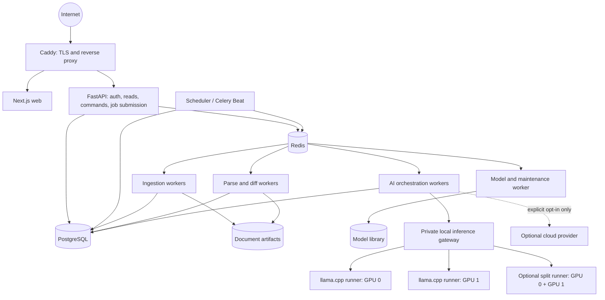

# Helvetic Lens public beta architecture

**Status:** accepted implementation contract (HL-029)

**Decision date:** 2 September 2026

**Ratified:** 3 September 2026

**Deployment target:** one Linux server with an Intel i7, 32 GB RAM, and two NVIDIA GTX 1080 GPUs

**Product default:** local Apertus inference; cloud providers are explicit optional integrations

**Product locales:** German, French, Italian, Romansh, and English

This document defines the architecture behind the public-beta backlog in [BACKLOG.md](../BACKLOG.md). It deliberately keeps Helvetic Lens on one physical server. The API, workers, database, queue, and inference runtime use separate processes or containers so a long PDF extraction or model request cannot block the website, but they remain one deployment, one repository, and one operational unit.

## Decision summary

Helvetic Lens will remain a **modular monolith on one host**. PostgreSQL is the durable source of truth. Redis and Celery move scans, connector synchronization, document processing, and AI work out of the web request. A private local inference runtime manages downloaded GGUF models and the available GPUs. The clean-install policy is `local_only`; Infomaniak and custom OpenAI-compatible endpoints remain available only after an organization administrator explicitly enables one.

The public corpus is shared, because ten organizations watching the same official act should not download and parse it ten times. Watchlists, company profiles, prompts, AI conclusions, cloud credentials, and user state belong to an organization. Official evidence remains immutable and every inferred impact links back to the exact saved passage, page, metadata record, or deterministic comparison that supports it.

The complete public product is localized in `de-CH`, `fr-CH`, `it-CH`, `rm-CH`, and `en-CH`. Interface locale, official document-expression language, and AI output language are independent values: changing the navigation language never relabels or replaces original legal evidence.

The target supports roughly 100 registered users and ordinary concurrent use through bounded work queues. It does not promise 100 simultaneous model generations. The actual GPU slot count, context size, and model profile must be measured on the two GTX 1080 cards before the public-beta claim is accepted.

If the selected local model is missing, stopped, or still loading, AI jobs enter `waiting_for_model`. The dispatcher retains them in PostgreSQL and does not substitute a cloud provider. `local_only` is the clean-install and deployment default; choosing a remote provider is a separate, visible organization-admin action.

## Ratified capacity contract

The following objectives are release gates for the single-host public beta. They are measured on the stated i7/32 GB/two-GTX-1080 host with the representative 100-account workload described below, not inferred from a model name or vendor specification.

| Concern             | Public-beta objective                                                                                                                                                                                         |
| ------------------- | ------------------------------------------------------------------------------------------------------------------------------------------------------------------------------------------------------------- |
| API reads           | Registry and document-detail p95 below 500 ms with 10–20 concurrent readers.                                                                                                                                  |
| Queue admission     | Validate and persist a command, including its durable job, in under 1 second p95; return an explicit quota/rate-limit result instead of waiting in the HTTP request.                                          |
| GPU slots           | Ship two generation slots only after the replicated profile passes concurrent load without OOM; otherwise ship one split-runner slot. `dev-1070` always starts with one slot.                                 |
| Memory              | Stay below 85% sustained host RAM, avoid host swap thrashing, bound each worker class, and complete the agreed load without GPU OOM.                                                                          |
| Recovery            | API readiness returns within 2 minutes of restart; eligible leased/queued work is redispatched from PostgreSQL within 60 seconds after workers/Redis recover, with no duplicate evidence or analysis records. |
| Connector freshness | Dispatch a due high-frequency discovery run within 5 minutes and a daily reconciliation within 30 minutes of its persisted schedule; expose misses and source lag.                                            |
| AI wait honesty     | Return the durable job immediately, expose `waiting_for_model`/queue state, and keep evidence pages responsive while all measured GPU slots are occupied.                                                     |

The accepted single-host risks are explicit: the server is one failure domain; host maintenance causes downtime; and PostgreSQL durability, Redis AOF, restart policies, and off-host backups improve recovery but do not provide high availability. Multi-host failover remains out of scope for this release.

## Why the earlier MVP had to change

The original application was a sound local MVP, but several deliberate MVP choices did not survive public hosting:

- FastAPI `BackgroundTasks` ran scans in the API process. HL-030 replaced this with durable PostgreSQL jobs and Redis/Celery execution.
- Analysis locks live in process memory, so multiple API processes cannot coordinate safely.
- Sources, laws, prompts, provider settings, and the company profile belong to one global workspace.
- `Law` combines an official legal document with the user's decision to monitor it. That would duplicate the same public source for every organization.
- Local Apertus is managed by the private model-manager container and a versioned model catalogue. Verified downloads, lifecycle state, host compatibility, and one active inference process are implemented; fair multi-GPU routing and target-host benchmarking remain in HL-032.
- The stack binds to loopback and has no login, TLS entry point, scheduler, queue, retention policy, or recovery workflow.
- The existing watchlist is a flat list. It cannot represent newly discovered bills, lifecycle events, court decisions, official notices, or evidence-backed relations between documents.

The existing strengths remain unchanged: immutable snapshots, separate observations, a complete exact passage audit beneath the legal-unit semantic diff, original artifacts, exact evidence links, saved AI history, prompt revisions, citation validation, and explicit failure states.

## Design principles

1. **Local AI is the normal path.** A stopped local model delays AI work but never causes an invisible cloud request.
2. **A legal fact needs evidence.** Official metadata and deterministic references are facts; an LLM relation is labelled as a possible impact until confirmed.
3. **The queue may deliver more than once.** Every job is idempotent, and PostgreSQL constraints protect versions, events, comparisons, and analyses from duplication.
4. **Redis accelerates coordination; it does not own business history.** Losing Redis may pause work or cache-backed coordination, but it must not erase sessions, legal evidence, jobs, or conclusions.
5. **Fetch public data once, personalize later.** Connector ingestion is global; organization-specific impact analysis starts only after a shared candidate relation exists.
6. **One host is an accepted constraint.** Separate processes improve isolation and restart behavior, but this release does not claim high availability.
7. **Measure old GPUs instead of guessing.** Model size, quantization, context, parallelism, and GPU split are enabled only after a repeatable benchmark.
8. **Keep the product usable without AI.** Registry, timelines, source evidence, versions, and deterministic diffs remain available when inference is queued or offline.
9. **Localize the interface, preserve the source.** Controls and explanations follow the user locale; official titles, passages, artifacts, identifiers, dates, and citations retain their actual language and provenance.

## Single-host topology



Only Caddy publishes ports to the Internet. PostgreSQL, Redis, the API container, workers, scheduler, model controller, and llama.cpp endpoints stay on private Docker networks. Development Compose may continue to bind services to loopback for local inspection.

This is not a microservice programme. The API, scheduler, and workers import the same Python domain modules, use the same migrations, and ship from the same backend image. Process boundaries exist for workload isolation, GPU ownership, and safe restarts.

## Component responsibilities

| Component               | Responsibility                                                                                             | Durable state                                          |
| ----------------------- | ---------------------------------------------------------------------------------------------------------- | ------------------------------------------------------ |
| Caddy                   | TLS certificates, host routing, security headers, request-size boundaries                                  | Configuration and certificates                         |
| Next.js                 | Registry, watchlists, comparison UI, impact inbox, login, organization and admin screens                   | None beyond build/runtime cache                        |
| FastAPI                 | Authentication, authorization, bounded reads, validation, commands, job creation, evidence serving         | PostgreSQL and artifact references                     |
| PostgreSQL              | Users, organizations, shared corpus, versions, events, relations, jobs, analyses, settings, audit facts    | Primary system of record                               |
| Redis                   | Celery broker, short leases, progress fan-out, rate counters, bounded cache                                | AOF is useful, but recovery comes from PostgreSQL      |
| Scheduler               | Finds due connector/source work and enqueues it once                                                       | Schedule/cursors in PostgreSQL                         |
| Ingestion worker        | Connector calls, downloads, metadata normalization, immutable source events                                | PostgreSQL plus artifact volume                        |
| Parse/diff worker       | HTML/PDF extraction, passage creation, hashes, deterministic comparison                                    | PostgreSQL plus artifact volume                        |
| AI worker               | Candidate review, prompt construction, structured validation, citation materialization, cached conclusions | PostgreSQL                                             |
| Model manager           | Hardware inventory, resumable downloads, checksums, activation, health, benchmark, log tail                | Model volume plus PostgreSQL catalogue                 |
| Local inference gateway | Stable internal OpenAI-compatible endpoint and routing to safe GPU slots                                   | Runtime-only state; deployment record is in PostgreSQL |

## Durable work and Redis queues

### Job record

Every long operation first creates a PostgreSQL `Job` in the same transaction as its command or outbox record. A dispatcher publishes eligible jobs to Redis. Workers update job steps and domain records transactionally and acknowledge the Redis delivery only after a durable checkpoint.

A job records at least:

- organization, job type, target entity, priority, and idempotency key;
- `queued`, `leased`, `running`, `retrying`, `succeeded`, `failed`, or `cancelled` state;
- current stage, completed/total units, attempt count, lease owner, heartbeat, and timestamps;
- bounded error details and links to connector run, version, comparison, or analysis;
- model/profile fingerprint for AI work and cursor/checkpoint for connector work.

The broker is allowed to redeliver. A worker claims the PostgreSQL row with a renewable lease, checks the idempotency key and existing result, then either resumes from the last durable step or returns the existing result. A stale lease is recoverable after an API, worker, Redis, or host restart.

### Queue classes

| Queue            | Initial concurrency | Examples                                              | Scheduling rule                                           |
| ---------------- | ------------------: | ----------------------------------------------------- | --------------------------------------------------------- |
| `interactive`    |         2 CPU tasks | short user commands, preview preparation              | low latency, bounded per organization                     |
| `ingest`         |     4 network tasks | Fedlex/Parliament/court synchronization, source fetch | per-source rate limits and jitter                         |
| `parse_diff`     |         2 CPU tasks | PDF extraction, passage alignment, deterministic diff | memory-limited; large PDFs cannot fan out without a bound |
| `ai_interactive` |  measured GPU slots | Ask Helvetic Lens                                     | higher priority with fair organization rotation           |
| `ai_background`  |  measured GPU slots | impact analysis and corpus linking                    | yields to interactive work without starving forever       |
| `maintenance`    |                   1 | model download/checksum, cleanup, backup checks       | disk- and bandwidth-limited                               |

The initial figures are safe starting points, not capacity claims. The target-server load test sets the shipped defaults. A PostgreSQL-backed admission/dispatch step applies per-organization inflight limits and round-robin fairness before work reaches the GPU queues.

Cancellation is cooperative. It stops future batches and preserves completed immutable evidence. A cancelled or failed AI job never changes a valid comparison into a failed comparison.

## Local model architecture

### Clean-install behavior

- The system starts in `local_only` mode.
- The first-run platform setup probes CPU, RAM, disk, CUDA devices, VRAM, and supported compute features.
- The model library recommends a compatible Apertus profile. An administrator reviews the source, license, quantization, disk size, expected VRAM, and context before downloading.
- A download uses a `.part` file, resumes safely, verifies a pinned revision and SHA-256, and moves the artifact atomically into the model library.
- The deterministic product works while no model is installed. AI jobs show `waiting_for_model` rather than calling a cloud endpoint.
- The active model is warmed and tested before it becomes the default for new jobs. Existing AI records keep their original model fingerprint.

### Model catalogue

The catalogue is a versioned allowlist, not a free-form URL executor. Each entry contains:

- display name, family, upstream repository, immutable revision, file, and format;
- parameter size, quantization, file size, checksum, license, usage-policy link, and acceptance state;
- chat template and structured-output capability;
- minimum RAM/VRAM/disk, recommended context, GPU mode, and slot limit;
- benchmark status for GTX 1070, single GTX 1080, and dual GTX 1080 profiles.

An advanced manual GGUF import may be added later, but it must be treated as unverified until the same compatibility and structured-output tests pass.

### Runtime controller

The runtime controller owns llama.cpp child processes and exposes a narrow private management API for inventory, activate, stop, warm up, benchmark, and health. Neither the public web container nor FastAPI receives the Docker socket. The controller starts only pinned binaries/images and catalogue model files; it cannot execute an arbitrary command supplied by a browser request.

The inference gateway gives the application one stable endpoint. It records the selected runner and forwards only to healthy slots. If one runner fails, its leased job returns to the durable queue and the deployment becomes `degraded`; a result is never silently rerouted to cloud.

The implemented HL-031 manager is bound privately inside Compose, with loopback ports only for local diagnostics. Its catalogue fixes the upstream revision, file size, SHA-256, license, chat template, runtime image digest, and hardware declaration. The manager adopts known legacy cache blobs without Internet access, keeps resumable partial downloads in a dedicated volume, and exposes only catalogue IDs plus fixed lifecycle verbs. Starting a verified model also selects its unique served model ID in the workspace's local Docker provider settings. HL-032 adds a stable multi-runner gateway, admission fairness, benchmark-derived profiles, and complete per-result deployment provenance.

### Hardware profiles

| Profile                | Intended host           | Initial model policy                                                                  |                   Expected parallelism |
| ---------------------- | ----------------------- | ------------------------------------------------------------------------------------- | -------------------------------------: |
| `dev-1070`             | one GTX 1070, 8 GB VRAM | small quantized Apertus or the already verified 1.5B test profile; short context      |                                      1 |
| `dual-1080-replicated` | two GTX 1080, 8 GB each | one quantized Apertus replica per GPU only if model + KV cache + headroom fit in 8 GB |                                      2 |
| `dual-1080-split`      | two GTX 1080            | one model split by layers across both GPUs when it does not fit safely on one         |                                      1 |
| `cpu-degraded`         | GPU unavailable         | small model for diagnostics or no inference                                           | measured, never the advertised default |

Apertus 8B in an approved GGUF quantization is the intended production default, but it becomes the shipped default only after the dual-1080 benchmark passes. The full BF16 8B profile and Apertus 70B are not appropriate defaults for this 16 GB aggregate VRAM and 32 GB RAM host. A model's advertised maximum context is also not the deployment context: KV-cache headroom, prompt size, batch strategy, and observed stability determine the configured limit.

For two equal GPUs, the benchmark tries replicated mode first for throughput and falls back to llama.cpp's compatible layer split when the model cannot fit on one card with safe headroom. Experimental tensor split is not a production default. GPU use is on by default; CPU offload is a measured fallback.

### Structured output and provenance

The existing local strategy remains mandatory: request a small schema-constrained signal and valid evidence-row numbers, reconstruct text from the saved rows on the server, and validate every citation. Model output never supplies an unchecked evidence URL or passage identifier.

Every AI record gains:

- runtime and backend type;
- model catalogue ID, upstream revision, GGUF checksum, and quantization;
- runtime image/binary version, hardware profile, context, slot, and generation settings;
- prompt, company-profile, source-version, and evidence fingerprints;
- queue wait, inference duration, token counts when exposed, validation/repair outcome, and coverage.

### Optional cloud integrations

Infomaniak and custom OpenAI-compatible adapters remain useful for comparison or temporary extra capacity, but they move under **Optional cloud providers**:

- disabled on a clean installation;
- enabled per organization by an organization administrator;
- never selected as an automatic fallback;
- accompanied by a clear destination and data-transfer notice;
- credentials are write-only, encrypted with a deployment key, redacted from logs, and scoped to one organization;
- each result states which backend processed it.

## Shared Swiss corpus and organization data

The domain separates public legal identity from an organization's watch state.

### Shared corpus

- `RegulatoryDocument`: canonical work such as an act, ordinance, bill, initiative, parliamentary business, court decision, or official notice.
- `DocumentIdentifier`: publisher namespace plus stable official identifier or canonical URI.
- `DocumentExpression`: language-specific expression when the authority exposes one.
- `DocumentVersion`: immutable artifact, normalized text, passages, hash, source dates, and provenance.
- `RegulatoryEvent`: new document, new version, amendment, repeal/replacement, status change, decision, or notice.
- `DocumentRelation`: evidence-backed `amends`, `repeals`, `replaces`, `implements`, `cites`, `interprets`, or `potentially_impacts` edge.
- `Connector`, `ConnectorRun`, and `ConnectorCursor`: configuration, coverage, cursor, checkpoint, and partial errors.

### Organization-owned data

- `Organization`, `User`, `Membership`, `Invitation`, and `Session`;
- `DocumentWatch`, chosen baseline, labels, active schedule, and organization-specific custom source;
- company profile, prompts, optional cloud configuration, encrypted credentials, and quotas;
- analysis and Ask history when it includes organization context;
- feed items plus per-user read, dismissed, and muted state;
- organization job visibility and integration diagnostics.

An official document is fetched and parsed once, then fanned out to every watching organization. An uploaded or pasted private document has an `owner_organization_id` and is never put into the shared public corpus. General source relations may be cached globally; a company-specific impact cache always includes the organization profile, prompts, model, and exact source-version fingerprints.

The migration creates a default legacy organization and moves all current workspace data into it without changing evidence IDs or artifact keys. Compatibility routes may exist during the migration, but every externally reachable lookup must resolve an active organization before public beta.

## Authentication and authorization

Registration asks for email, password, person name, and an optional organization name. If the organization name is empty, the user receives a personal organization. The first member is its organization administrator. Joining an existing organization requires a single-use, expiring invitation; matching a typed organization name is never enough.

Passwords use Argon2id. The browser receives a random, revocable, expiring `Secure`, `HttpOnly`, `SameSite` session cookie; it does not store tokens in local storage. Session records live in PostgreSQL, with Redis used only as a short cache or rate counter. Cookie mutations use CSRF protection. Registration, login, fetch, scan, and AI submission have Redis-backed IP/user/organization limits.

| Capability                                                             |       Platform admin        | Organization admin | Viewer |
| ---------------------------------------------------------------------- | :-------------------------: | :----------------: | :----: |
| Read shared registry and own organization data                         |             Yes             |        Yes         |  Yes   |
| Manage organization watchlist, sources, prompts, profile, cloud opt-in | Only when also an org admin |        Yes         |   No   |
| Invite/remove organization members                                     | Only when also an org admin |        Yes         |   No   |
| Run scans, Ask, or reanalyse                                           | Only when also an org admin |        Yes         |   No   |
| Manage local models, GPUs, global connectors, workers, storage         |             Yes             |         No         |   No   |
| View another organization's data                                       |        No by default        |         No         |   No   |

Viewer mutation controls are absent from the UI, and the API independently returns `403` for a direct mutation attempt. Personal read/dismiss state may remain writable because it does not change shared evidence.

The first platform administrator is assigned with an idempotent CLI command before the server is exposed, for example `helvetic-lens admin promote --email ...`. The CLI lists, promotes, and demotes platform administrators, records the action, and refuses to remove the last one. Direct database editing and a public “become admin” page are not supported.

## Localization and source-language architecture

The supported interface locales are `de-CH`, `fr-CH`, `it-CH`, `rm-CH`, and `en-CH`. Locale resolution uses authenticated user preference first, then a pre-login cookie, a supported browser `Accept-Language`, and finally the documented deployment default. Locale is personal presentation state; it does not fork organization records or change the language of an official artifact.

Next.js uses namespaced, repository-owned catalogues with ICU-style parameters and plurals. Pages do not build sentences from translated fragments. Stable API error codes, enum values, identifiers, and job states remain language-neutral; FastAPI returns typed parameters and the presentation layer renders the message. Missing/unused keys and placeholder/plural mismatches fail CI. A pseudo-locale or equivalent long-text pass catches clipped controls before human review in all five languages.

Dates and numbers use CLDR/`Intl` formatting for the selected Swiss locale. Stored instants remain UTC, while registry grouping uses Europe/Zurich unless a later user-timezone feature explicitly changes it. Source-stated publication, version, effective, and decision dates retain their precision and provenance; the interface never turns a fetch timestamp into a legal date.

Every official expression carries a BCP 47 language tag. Fedlex may expose several expressions, Parliament's English fields may be incomplete, and a Federal Supreme Court judgment normally exists only in its judgment language. The interface shows the languages that actually exist and says when the selected one is unavailable. Machine-generated translations are labelled, link to the unchanged original evidence, and never become official `DocumentVersion` records. Citation quotes always come from the exact saved source-language passage.

Impact and Ask requests include an explicit output locale. `output_locale` is persisted in AI history and participates in the cache/idempotency fingerprint, so a German answer cannot satisfy an otherwise identical French request. Changing UI locale does not rewrite an earlier answer; history shows its language and may offer an authorized regeneration. Fixed schemas, row selection, and citation validation remain language-neutral. A local-model language failure is visible and retryable; it never causes a silent cloud fallback.

Search indexes titles from every available official expression plus language-neutral identifiers. Query processing is Unicode-aware and safe for German umlauts, French/Italian accents, and Romansh text. Results identify the matched expression/language and never imply that a machine-translated corpus is official source text. Invitations and later digests render in the recipient's stored locale with a documented fallback.

## Connector architecture

Before connector output enters comparison or inference, each immutable version receives a revisioned identity passport. It records the authority, official ELI/SR/RS or docket where available, legal-work kind, detected title and language, version/publication dates, source and extraction provenance, bounded evidence, and a deterministic fingerprint. Pair classification is deterministic: connector metadata and official identifiers can verify or contradict identity; title similarity can only make a pair probable or unknown.

An official conflict quarantines the artifact and cannot be overridden. An unknown assignment requires a separate audited user decision, while the artifact itself remains labelled unknown. Comparison identity is persisted with its own fingerprint and participates in AI cache keys, so connector metadata, extraction, or assignment changes invalidate reuse without deleting historical output.

Every official source implements one versioned adapter contract:

```text
discover_since(cursor) -> page of stable source identities + next checkpoint
fetch_metadata(external_id) -> normalized metadata + bounded raw provenance
fetch_versions(external_id) -> version/expression descriptors
fetch_artifact(version) -> official bytes or source text
extract_explicit_relations(version) -> evidence-backed identifiers/relations
health() -> connectivity and source-contract state
```

The common ingestion pipeline owns URL validation, artifact storage, hashes, extraction, deduplication, event creation, retry policy, cursor safety, and integration logs. A connector cannot bypass immutable evidence rules. Checkpoints advance only past a successfully persisted page or safe partial boundary. A rerun with the same cursor is harmless.

### Fedlex federal law

The existing direct-URL ELI resolver remains in place. The new connector uses the small DE/FR/IT RSS feeds for low-latency discovery and adds catalogue-wide, paginated reconciliation through the official Fedlex Linked Data/SPARQL service. It preserves work → expression → manifestation identity and tracks supported Classified Compilation, Official Compilation, and Federal Gazette records, languages, version/consolidation dates, formats, and explicit lifecycle or relation metadata where available. The English feed is supplementary because its coverage is incomplete.

RSS is not the history: it contains only a bounded recent window, so daily SPARQL reconciliation/backfill with an overlap is mandatory. If the source does not expose a reliable modification field for a collection, the connector performs a bounded reconciliation sweep instead of pretending it has a perfect cursor. It dereferences public ELI resources/content negotiation rather than scraping blocked `/filestore/*` paths and uses low concurrency because no numeric public rate limit was identified.

JOLux `Citation` and `LegalResourceImpact` records are the primary source for explicit cross-law links. The connector combines the official business-status, mutation, and consolidation history needed to interpret those records before asking the model for possible additional relations. SR/RS number is retained as an identifier but never used as the immutable primary key because an official tutorial warns that it can be reused after a total revision. A missing search result never proves repeal; only official status/replacement evidence creates that event.

### Swiss Parliament

The official Parliament web service exposes JSON and XML with 50-row paging and DE/FR/IT/EN language selection. Affairs have stable IDs, short IDs, and an `updated` timestamp; related types, states, summaries, drafts, documents, committees, sessions, and votes are available through dedicated resources. Substantive English content can be incomplete, so the connector records actual language availability.

The connector first runs a bounded source-contract spike to verify update filters and ordering. The current affair list is ordered by ID rather than `updated`, so bootstrap pages the complete lightweight catalogue once, stores every item's `(id, updated)` value, frequently revisits current-year/new and all known non-final affairs, and runs periodic full reconciliation in controlled pages. It never assumes the first page contains all recently updated old business. The adapter boundary is explicit because Parliament says this older API remains available only until further notice while a replacement is planned.

State changes create events without manufacturing a new legal-text version. Explicit references to SR/RS numbers, ELI URIs, or Fedlex documents create deterministic relation candidates. Title-only matches remain proposed. Reused data visibly attributes `Parlamentsdienste der Bundesversammlung, Bern`, carries its retrieval date, and keeps Helvetic Lens analysis separate from the official record.

### Swiss Federal Supreme Court

The initial court scope is the Swiss Federal Supreme Court, not every cantonal court. Its official site provides the leading-decisions database, a broad judgments database that is effectively complete from 2007, a “new decisions” date index, RSS, and yearly sitemaps. No stable documented public JSON change API was identified, so implementation starts with a source-contract/terms check and a conservative adapter over the official latest index, yearly sitemap, and decision HTML. The published robots policy specifies a two-second crawl delay, which is a hard lower bound for fetch scheduling.

The connector stores stable Aza/docket identity, court/chamber, decision date and insertion/publication date separately, language, official JumpCGI/source URL, descriptors/norms when exposed, and immutable HTML text. Free official decisions are generally served as HTML; the connector does not invent a downloadable source PDF when the authority did not publish one. It polls the latest/date index, reconciles the current and previous yearly sitemaps by identity/`lastmod`, and avoids repeatedly downloading the extremely large all-decisions RSS snapshot. A changed search template or implausibly empty interval becomes a connector failure rather than silently returning zero decisions. A judgment may cite or interpret a law; it is never described as changing the statutory wording.

Federal Administrative Court and Federal Criminal Court sources use separate future adapters because their Weblaw interfaces are undocumented implementation details. A non-official aggregator may be evaluated later for discovery coverage, but its metadata cannot replace an official artifact or be presented as the authority.

### Official news and notices

Notices or press material exposed by the three core authorities are normalized as `official_notice` events when they have stable provenance. Broader Federal Council, department, regulator, and consultation news feeds are a separate connector after the core three are reliable. Generic crawling is not the primary strategy when an official API, feed, catalogue, or stable publication list exists.

## From monitoring to impact intelligence

The analytics pipeline avoids comparing every new item with every watched law:

1. A connector persists a new or changed document/version and creates one `RegulatoryEvent`.
2. Deterministic extraction finds ELI/SR/RS identifiers, article citations, explicit replacement/amendment metadata, parliamentary references, and court norms.
3. PostgreSQL full-text search and normalized metadata produce a bounded candidate set for watched laws not already linked explicitly.
4. Confirmed official relations are stored directly. Other candidates enter the local-AI queue with the exact supporting passages and metadata.
5. Apertus returns a small validated relation/impact signal and evidence row numbers. The server reconstructs the explanation from saved evidence and rejects unsupported citations.
6. General relation evidence is reused across organizations. Company-profile analysis creates an organization-specific impact, priority, and suggested actions.
7. The impact inbox fans one event out to affected watchlists without duplicating the source fetch or general relation work.

Embeddings and pgvector are not required for public beta. They are added only if a labelled recall benchmark shows that identifiers, metadata, and PostgreSQL full-text search miss material candidates. Similarity may propose a candidate; it is never evidence by itself.

Relations have a provenance method (`official_metadata`, `exact_identifier`, `text_rule`, `model_proposal`, or `human_review`), evidence references, model/rule revision, confidence, and `confirmed`, `proposed`, or `rejected` state. Contradictory or superseded edges are versioned rather than overwritten.

## Registry and impact inbox UX

The primary registry has two bounded views: **My monitored documents** and **All discovered events**. It uses server-side search, cursor pagination, and non-overlapping Europe/Zurich groups:

- Today
- Yesterday
- Last 7 days, excluding Today and Yesterday
- Last 30 days, excluding the prior groups
- Older
- Custom date range

Grouping uses `detected_at`. Rows separately label source `published_at`, document `version_date`, and `effective_from/effective_to`; a fetch timestamp is never displayed as an official legal date. Filters cover document kind, authority, language, lifecycle state, impact, watched/unwatched, unread, and connector health.

Each event row answers: what happened, to which document, when Helvetic Lens detected it, what official date is known, which monitored laws may be affected, and what the user can inspect next. Law detail shows its version/event timeline plus incoming and outgoing relations.

The impact inbox groups one source event with every affected monitored law. It distinguishes **Confirmed relation** from **Possible impact**, shows why the item is present, and opens exact evidence. Per-user read/dismiss/mute state never deletes the shared event. An organization administrator can confirm or reject a proposed relation and, when an act is replaced, add the successor to the watchlist.

## Public deployment and operations

The production Compose/override starts the whole stack with one documented command. It includes startup migrations, readiness checks, restart policies, log rotation, persistent named volumes, and fixed image versions or digests. Only ports 80 and 443 are public.

Required operating controls:

- PostgreSQL plus documents, configuration, and evidence metadata are backed up to a separate destination and restored in a documented rehearsal. Downloaded models may be recreated and need not dominate backups.
- Redis uses AOF with `everysec` and `noeviction`, while PostgreSQL job recovery protects against broker loss.
- Integration diagnostics, jobs, and operational logs have bounded retention. Immutable legal evidence and user-requested history use a separate policy.
- Secrets come from deployment environment/secret files. They do not enter images, Git, browser responses, structured logs, or model prompts unrelated to that integration.
- Existing SSRF, redirect, document-size, extraction, and safe-rendering boundaries remain active. Public registration and AI/fetch jobs add rate limits and organization quotas.
- Upgrades take a pre-migration backup, run forward-compatible migrations, verify readiness, and document rollback limits.

Operational logs carry request, job, connector-run, document/event, comparison/analysis, and internal organization correlation IDs. They never contain raw passwords, cookies, credentials, or unbounded document/model bodies. Existing redacted Integration logs remain an inspect-on-demand diagnostic surface.

Metrics cover API latency/5xx, database pool, Redis health, queue depth and oldest age, retries/dead letters, worker heartbeat, connector freshness/cursor lag, scheduler misses, local model health, GPU VRAM/utilization/temperature, queue wait, inference duration/tokens/context/OOM, disk usage, and backup age. High-cardinality document URLs and user IDs are not metric labels.

`/health/live` proves only process liveness. `/health/ready` verifies required database/Redis dependencies and reports model or connector degradation separately. A stopped model must not make evidence reads unavailable, and a healthy API must not hide a dead model.

## Capacity envelope and acceptance

“Supports 100 users” means a measured usage profile on the target host, not 100 simultaneous generations. The public-beta gate defines the scenario before testing, for example 100 accounts across several organizations and all five locales, 10–20 concurrent readers, concurrent registry filters and evidence views, several scan submissions, scheduled connector traffic, and 20 AI jobs accepted into a fair queue.

Initial non-AI service objectives on the target host:

- registry/detail read p95 below 500 ms under the agreed test;
- command validation and job enqueue p95 below 1 second;
- HTTP error rate below 1%, excluding intentional validation/rate-limit outcomes;
- bounded database connections, no unbounded worker memory, no host swap thrashing, and no GPU OOM;
- API response remains fast while GPU work is queued;
- one organization's large comparison cannot permanently starve another organization's short interactive job.

The test records idle and peak CPU, RAM, VRAM, disk, and network; model load time; verified context; stable slots; input/output tokens per second; queue wait and drain time; connector duration; and backup/restore duration. It kills and restarts API, worker, Redis, and model processes and proves that jobs recover without duplicate versions, events, comparisons, or analyses.

If replicated Apertus 8B does not fit reliably on each GTX 1080, the shipped profile moves to one split runner or a smaller Apertus model. The measured result wins over the desired model name. The UI must remain honest about expected wait and active capacity.

## Delivery order

The safe sequence is:

1. Add durable jobs, model management, local-first routing, and hardware benchmarks.
2. Establish the five-locale catalogue/error/date conventions, add organizations and authentication, then migrate the current workspace into a default organization.
3. Separate the shared regulatory corpus from organization watchlists and introduce normalized events.
4. Implement the connector contract, Fedlex catalogue, Parliament, court, and scheduled fan-out.
5. Add deterministic candidate generation, evidence relations, local impact analysis, and the inbox.
6. Add the public reverse proxy, operations/admin surfaces, backups, observability, and the 100-user gate.

Localization ships alongside every screen rather than as a final translation pass. Public-beta acceptance includes one complete browser path and one real local-Apertus cited response in each supported locale.

New broad connectors must not land before the organization/corpus migration, otherwise tenant scoping and deduplication would need to be retrofitted into the same records a second time.

## Explicitly deferred

- Kubernetes, multi-host workers, distributed GPU RPC, and database high availability;
- enterprise SSO, SCIM, complex custom roles, or a separate identity platform;
- autonomous legal decisions or an LLM changing confirmed legal relations without review;
- an unbounded crawler over the Swiss web;
- a visual graph before the relation list and evidence workflow are proven useful;
- pgvector before a labelled candidate-recall benchmark justifies it;
- training or fine-tuning a model before prompt, evidence, and model-profile evaluations show a specific gap.

## Verified source and runtime references

These references were checked on 2 September 2026. They are implementation inputs, not a guarantee that an external contract will never change.

- [Fedlex Linked Data](https://fedlex.data.admin.ch/) describes its ELI/RDF knowledge graph and SPARQL access.
- [Fedlex LINDAS data-use page](https://ld.admin.ch/data-usage/fedlex/) describes the official dataset and reuse path.
- [Fedlex SPARQL endpoint](https://fedlex.data.admin.ch/sparqlendpoint) is the machine-query endpoint already used by the narrow ELI resolver.
- [Fedlex URI conventions](https://fedlex.data.admin.ch/en-CH/home/convention) describe work, expression, manifestation, language, date, and format URI patterns.
- [Official Fedlex SPARQL tutorial](https://swiss.github.io/fedlex-sparql/lab/index.html?path=fedlex.ipynb) demonstrates the data model and warns about identifier/history details.
- [Fedlex RSS](https://fedlex.data.admin.ch/api/rss-de.xml) provides a bounded recent-discovery feed that must be paired with reconciliation.
- [Swiss Parliament Open Data / Webservices](https://www.parlament.ch/de/%C3%BCber-das-parlament/fakten-und-zahlen/open-data-web-services) states that the current service remains available and documents its reuse conditions.
- [Swiss Parliament web service](https://ws-old.parlament.ch/) exposes JSON/XML, paging, languages, affairs, summaries, types, states, and related resources.
- [Curia Vista](https://www.parlament.ch/en/ratsbetrieb/Pages/Curia%20Vista.aspx) describes parliamentary business coverage from the 1995 winter session.
- [Swiss Federal Supreme Court judgment databases](https://www.bger.ch/index/juridiction/jurisdiction-inherit-template/jurisdiction-recht.htm) describes leading decisions and the broad decisions database.
- [Swiss Federal Supreme Court latest decisions](https://search.bger.ch/ext/eurospider/live/de/php/aza/http/index_aza.php?lang=de&mode=index&search=false) is the official date-oriented discovery surface.
- [Swiss Federal Supreme Court sitemap index](http://relevancy.bger.ch/sitemaps/sitemapindex.xml) exposes yearly reconciliation sources.
- [Swiss Federal Supreme Court search guidance](https://www.bger.ch/files/live/sites/tfl/files/pdf/Rechtsprechung/Expertensuche_Suchstrategie_2023_04_13_d.pdf) documents database coverage and indexed norms/descriptors.
- [Apertus v1.5 8B model card](https://huggingface.co/swiss-ai/Apertus-v1.5-8B) documents the model family, context capability, supported runtimes, licence gate, and hardware-dependent deployment settings.
- [llama.cpp server documentation](https://github.com/ggml-org/llama.cpp/blob/master/tools/server/README.md) documents the OpenAI-compatible server, JSON/schema constraints, model router, slots, metrics, and CUDA container.
- [llama.cpp multi-GPU guide](https://github.com/ggml-org/llama.cpp/blob/master/docs/multi-gpu.md) documents layer and tensor split modes, GPU selection, KV cache, and their trade-offs.
- [Docker Compose GPU support](https://docs.docker.com/compose/how-tos/gpu-support/) documents GPU reservations and device selection for Compose services.
