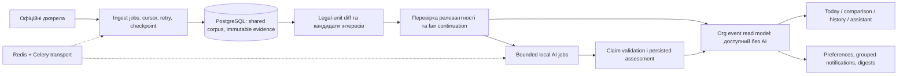

# Helvetic Lens: аудит цінності, UX та архітектури

**Дата:** 4 вересня 2026. **Перевірена ревізія:** `4c70d3a` у `main`; локальний checkout збігався з `origin/main` після fetch. Це експертний аудит реалізації, а не дослідження ринку, сертифікація доступності чи висновок про юридичну правильність відповідей.

## Висновок

**Helvetic Lens має корисну інженерну основу, але ще не є завершеним щоденним порталом моніторингу.** Він уже вміє зберігати джерела, версії, докази, історію та організаційні дані. Проте користувач досі мусить сам з'єднувати технічні модулі, інтерпретувати слабкі підказки й відділяти шум від важливого. Наявність AI, десятків екранів і зелених тестів цього не виправляє.

Називати його зараз найзручнішим чи доведено корисним для багатьох людей було б неправдою. У репозиторії немає достатніх результатів незалежних користувацьких досліджень, тривалого пілоту та оцінки реальної релевантності. Це **не доказ відсутності попиту**: попит ще потрібно перевірити.

Найперспективніша обіцянка: **«Я пояснюю, що мене цікавить. Система повідомляє про справді релевантні події, показує, чому вони важливі саме для нас, і дає перевірити першоджерело».** Критерій успіху — менше пропущених важливих подій і менше часу на їх розуміння, а не більше чанків, повідомлень, конекторів чи жартів.

## Як проводився аудит і що він не доводить

- Перевірено Git-стан, README, backlog, архітектурні/операційні документи та реалізацію frontend, ingestion, comparison, AI, matching, notifications, tenancy і model runtime. Три паралельні агентні перевірки охопили UX, AI/архітектуру та відповідність backlog реалізації; це не незалежна зовнішня експертиза.
- Локальний портал переглянуто через Chrome: Today, Topics, Monitoring, Impact inbox, Sources, сторінку документа з версіями, незмінене та історичне порівняння, мобільний Ask і Marvin. Discover відкрито, але його завантажений список не оцінювався; onboarding/auth/admin додатково перевірені в коді та документах.
- Desktop: приблизно 1920 × 863; mobile: viewport 390 × 844. Перевірено видимий UI, accessibility tree та computed styles проблемних вкладок. Mobile viewport відновлено. Це не тест на фізичному iPhone/Android, не Safari/Firefox-прохід і не повний screen-reader аудит.
- Не змінювалися джерела, підписки, ролі чи збережені AI-висновки. Нові платні AI-запити не запускалися. Прочитані історичні відповіді позначені нижче як історичні; вони не видаються за новий benchmark поточної моделі.
- Публічні UX-орієнтири перевірено за першоджерелами нижче. Firecrawl не мав доступних кредитів, тому джерела прочитано через звичайний web-інструмент. Приватні логи й документи в зовнішні сервіси не передавались.
- Не вимірювалися реальна retention, willingness to pay, production SLA, пропущені події чи місткість dual-GTX-1080 сервера. Числові цілі в backlog — **запропоновані критерії приймання**, не досягнуті результати.

Позначення доказів: **UI** — побачено в поточному браузері; **Code** — встановлено з коду; **History** — збережений старий результат; **Hypothesis** — потребує вимірювання або перевірки з людьми. Шляхи/номери рядків нижче відносяться до ревізії `4c70d3a`.

## Що вже варто зберегти

1. Незмінні версії та точні посилання на збережені уривки — сильніша основа довіри, ніж розмова з моделлю без збереженої доказової історії.
2. Перевірка ідентичності документа, повний детермінований diff і класифікація шуму вже існують. Старі snapshots та класифікації, однак, не стають автоматично якіснішими після оновлення extractor.
3. Є обмежені плани AI: до п'яти викликів для Impact і трьох для Ask, повторне використання результату, валідація citations і одна спроба repair. Повертати тисячі послідовних викликів не потрібно.
4. PostgreSQL як джерело істини, Redis/Celery, durable jobs, shared corpus, org isolation і приватний локальний runtime відповідають single-host задуму.
5. Уже виправлено значну частину старого UX: sidebar має власний scroll, є mobile bottom navigation, Company profile — звичайна сторінка, comparison має вкладки, Ask — background job, є source packs та durable topics. Старий [UX-аудит](UX_PRODUCT_AUDIT.md) не слід читати як список усіх поточних дефектів.
6. Каталог джерел чесно показує обмеження; модель і cloud provenance не приховані. Це потрібно зробити простішим для користувача, а не прибрати.

## Кому спочатку бути корисними

«Усім, хто цікавиться законами» — занадто широкий початковий сегмент. Робочі гіпотези для інтерв'ю:

| Група | Повторюване завдання | Що означає реальна користь |
| --- | --- | --- |
| Невелика професійна асоціація / policy-аналітик | Стежити за темою від консультації до парламенту та нового регулювання | Своєчасно побачити розвиток теми й підготувати обґрунтований короткий огляд |
| Відповідальний за compliance/операції у швейцарській організації | Зрозуміти, чи стосується зміна конкретної діяльності | Відрізнити «дії не потрібні» від «потрібна перевірка конкретного процесу» |
| Журналіст / дослідник / зацікавлений мешканець | Відстежувати питання та знаходити перевірювані першоджерела | Не плутати пропозицію, коментар у медіа й чинну норму |

Спочатку дослідити перші дві групи, обрати одну основну за результатом. Не робити одночасно юридичну енциклопедію, новинну соціальну мережу й enterprise compliance suite. Для громадського використання спростити читання, але не вдавати, що модель надає остаточну юридичну пораду.

## Основні поточні проблеми

| # | Доказ і спостереження | Наслідок | Backlog |
| --- | --- | --- | --- |
| 1 | **UI + Code:** Today показує чотири технічні лічильники та watchlist. Немає завершеної єдиної стрічки інтересів. `apps/web/components/workspace.tsx:402,444`; `app/page.tsx:4`. | Користувач не отримує відповіді «що для мене важливо сьогодні?». | HL-076, HL-089, HL-078, HL-079 |
| 2 | **UI + Code:** Topics починається з великого manual plan builder: concepts, synonyms, exclusions, jurisdiction, п'ять технічних pack IDs, мови, вісім document kinds і вісім event kinds. Onboarding — три статичні картки. `monitoring-topics-page.tsx:228`; `app/onboarding/page.tsx:10`. | Щоб висловити простий інтерес, потрібно зрозуміти внутрішню модель системи. | HL-073, HL-095, HL-086 |
| 3 | **UI + Code:** непозначені як disabled вкладки Actions/Ask/History майже невидимі. Їх текст — `rgb(240,242,247)`, 10 px. `globals.css:63,64,1186` використовує surface token як foreground; обчислений контраст приблизно 1.09:1 на desktop та 1.12:1 на білому mobile surface. | Головна AI-функція виглядає недоступною. Це конкретний дефект, а не суб'єктивний смак. | **HL-097, негайно** |
| 4 | **Code + History:** Docker route замінює rich Impact/Ask output на вибір citation rows та impact/supported, після чого сервер склеює уривки. `analysis.py:2619,2646,2679–2709,2826`. У збереженій історії видно «This batch contains… Cited changes…». | Локальний AI часто не пояснює нічого своїми словами. Заміна 1.5B на 8B сама не змінить provider-based routing. | **HL-091** |
| 5 | **Code:** rich report завжди записує effective/compliance dates як `not_found`/null для material change; applicability та обмеження переважно шаблонні. `analysis.py:2110–2232`. | «Дату не знайдено» може означати, що її не витягували; красива форма створює хибне враження завершеного аналізу. | **HL-092** |
| 6 | **UI + Code:** у Impact inbox кліматична консультація пов'язана з direct-payments regulation через `uber, verordnung`. Чисте локальне відтворення scorer дає 0.233333 при порозі 0.16. `relation_candidates.py:32–49,92–122`. Один історичний результат позначений High. | Загальні слова назви можуть створити шум і неправдоподібну тривогу. Наявність цитованого ID ще не доводить висновок. | **HL-100, HL-093** |
| 7 | **Code:** `candidate_fact` зі scoring rationale входить до citable evidence; fallback може підставити generic explanation і зберегти `supported` та High. `service.py:3958–3974`; `relation_analysis.py:103–110,295–307,355–407`. | Діагностика пошуку перетворюється на «доказ впливу». Потрібна перевірка суті твердження, не лише JSON. | **HL-100** |
| 8 | **UI + Code:** чотири картки з однією назвою/URL у inbox; created/new-version/language events групуються лише за event ID. `connectors.py:752–821`; `impact_inbox.py:313–327`. Це не доводить дублювання ingestion. | Один розвиток подій може виглядати як кілька новин. Старий документ, щойно знайдений crawler, може сприйматися як новий закон. | HL-076, HL-078 |
| 9 | **Code:** ліміти 100 org / 50 topics / 20 matches / 500 history events не всюди мають durable continuation. `topic_matching.py:129–153,274–301,364–388`. Preview має окремий scorer (`monitoring_topics.py:504–574`). | Bounded work може мовчки означати пропущений моніторинг; preview і майбутні matches можуть розходитися. | **HL-094** |
| 10 | **UI + Code:** джерела мають 23 streams: шість available і 17 partial у каталозі; local starter не активований. Registry для legacy watches показує `native · unclassified document · und · unknown`, навіть для відомих Fedlex документів. | Користувач не розуміє, що реально покривається; старі метадані заважають довірі. Відсутність подій не означає, що нічого не сталося. | HL-098, HL-073 |
| 11 | **UI + Code:** дев'ять filters + два date inputs перед registry results; material comparison виводить усі clusters і raw unit IDs. `registry-page.tsx:219`; `comparison-view.tsx:892,917,976`. | Забагато налаштувань перед результатом, довге читання й технічний словник. | HL-095, HL-096 |
| 12 | **Code:** enabled UI enum labels обходять i18n; overlay focus isolation неповна; mobile gate пропускає topics/Marvin та може пропустити comparison. `registry-page.tsx:224`; `monitoring-topics-page.tsx:76`; `comparison-view.tsx:1018`; `scripts/check-mobile-browser.mjs:277,316`. | П'ять словників і responsive CSS ще не означають п'ять якісних доступних продуктів. | HL-057, HL-097, HL-088 |
| 13 | **Code, ризик потребує load test:** inbox завантажує всі candidates/user states, робить per-item lookups, фільтрує в Python; digest використовує той самий шлях. `impact_inbox.py:286–369`; `digests.py:308`. | На зрілому корпусі читання й дайджести можуть стати повільними незалежно від GPU. | HL-099, HL-049 |
| 14 | **UI + Code:** Marvin має окремо personal chat і cited-Ask draft, багато контексту перед введенням, вкладені scroll regions. Proactive angle selection використовує interactive local priority; chat persist відбувається після відповіді. `marvin-companion.tsx:838,950`; `main.py:900–925`; `service.py:3130–3188`. | Додаткова плутанина й потенційна конкуренція жартів із корисною AI-роботою. Реальний вплив на чергу ще не виміряний. | HL-083–HL-087 |

Додатково: edit topic використовує `window.scrollTo` (`monitoring-topics-page.tsx:207`), хоча desktop scroll належить `.main`. У живому середовищі не було збережених topics для відтворення цього сценарію; це code finding, не завершений UI regression test.

Відтворення scorer використовувало назви **Verordnung über die Berichterstattung über Klimabelange** та **Verordnung über die Direktzahlungen an die Landwirtschaft**, authority `fedlex/fedlex`, kind `consultation/act`. Це відтворення поведінки поточного scorer на явно заданих входах, а не повний replay історичного saved record. Скорочені frontend-шляхи в таблиці — відносно `apps/web/components/` (CSS — `apps/web/app/`), backend-шляхи — відносно `services/api/helvetic_lens/`.

Історична comparison пара на BBl 1999 8633 показує шість material changes, зокрема розриви слів у старому extraction. **Не можна виправляти це стиранням оригіналу чи тихою зміною старого AI-звіту.** Потрібні versioned re-extraction/reclassification, видима причина зміни та контрольоване supersession.

## Яким має бути щоденний досвід

1. **Перше відвідування:** обрати мову й намір — «стежити за темою», «стежити за законом», «подивитися події». Ввести звичайне речення. Система пропонує зрозумілий, редагований scope і чесну coverage картку. Admin підтверджує shared monitor; viewer надсилає запит, не обходить права.
2. **Перший результат:** побачити кілька справжніх збережених прикладів з датою та першоджерелом. Якщо нічого не знайдено — пояснення і наступна перевірка. Ніякої підміни live result синтетичною демкою.
3. **Today:** спочатку зміст, потім інструменти. Кілька подій «потребує уваги», решта — короткий огляд. Окремо «нових релевантних подій немає» та «покриття неповне / джерело недоступне».
4. **Картка події:** що сталося; proposal/consultation/decision/enacted status; чому це стосується моєї теми й організації; чому важливо або не дуже; дата публікації окремо від виявлення; першоджерело; одна найкорисніша дія. Деталі, scores та технічні версії — за розкриттям.
5. **Розуміння:** короткий summary → змістовний before/after → точна цитата. Запитання доступне одразу, контекст зрозумілий. Перехід у доказ і назад не губить позицію чи відповідь.
6. **Рішення:** «ознайомився», «не стосується», «перевірити процес», «зберегти нагадування», «уточнити тему». Не змушувати підтверджувати штучну action, коли нічого робити не потрібно.
7. **Повернення:** одне повідомлення про розвиток події, не чотири про мовні версії. Власні unread/mute/quiet hours; спільні докази й висновки організації; direct link відкриває саме ту версію, про яку повідомляли.

### Що саме просити в AI

AI не має встановлювати факт зміни, достовірність URL або права доступу. Це детерміновані функції. Його корисна робота: **стисло пояснити перевірені зміни, зіставити їх із заданою діяльністю організації та запропонувати обґрунтований наступний крок**.

Контракт результату: короткий заголовок; `what_happened`; `why_in_radar`; `why_it_matters`; статус і дати з provenance; застосовність та умови; конкретна review action або `no_action_now`; claim-level citations; невизначеність і що саме не перевірено. Retrieval score не є legal evidence. Непідтверджена AI-оцінка High не зберігається після провалу semantic validation; незалежно підтверджена офіційними даними терміновість не зникає через збій AI.

Для коротких документів допустимий один bounded запит з обома повними нормалізованими текстами, material diff і компактним профілем, якщо token/context budget це дозволяє. Для великих — значущі legal units, достатній сусідній контекст і coverage manifest; повний diff завжди збережений. Raw PDF варто передавати лише профілю, який перевірено підтримує цей тип вводу; сам upload не лікує помилкове зіставлення чи слабке міркування. Не обрізати мовчки доказову базу й не повертатися до тисяч викликів.

Для tiny model чесний режим «відібрані уривки» кращий за псевдоаналіз. Для перевіреної локальної моделі — справжній короткий висновок. Capability має залежати від profile/model revision і task-quality evidence, а не від `provider == docker`. Синтаксична успішність 20/20 відповідей не означає 20 правильних висновків.

### Дизайн: спокійний, читабельний, виразний

Нинішня композиція має хороші відступи й впізнавану основу, але змішує нову синю палітру зі старими olive/orange компонентами, має надто дрібні метадані та малої цінності технічні підписи. Спочатку виправити невидимий текст, потім узгодити typography/spacing/color/interaction tokens.

Робочий напрям: швейцарська точність, виразна типографіка, стриманий колір, достатньо повітря, щільність за потребою. Один primary action на контекст, хороший reading measure, звичайні назви статей замість hashes, статуси з текстом та іконкою. Mobile — самостійний щоденний сценарій, а не зменшена desktop таблиця. Основні touch targets — продуктова ціль 44 px; це не тотожне мінімальній вимозі WCAG.

Марвін може бути теплою особливістю продукту. Він не повинен бути єдиним шляхом до важливої дії, перекривати поле вводу чи жартувати замість пояснення помилки. Характер зберігається; частота й звук контролюються користувачем. Корисний контекстний коментар важливіший за демонстрацію «спонтанного AI».

## Архітектурне рішення

**Залишити modular monolith на одному сервері.** Не додавати Kubernetes, окрему vector DB, microservices, event bus чи іншу модельну службу без виміряної причини. API, web, CPU workers, AI worker, scheduler і model runner можуть бути різними контейнерами одного deployment.

- Один official artifact збирається один раз; org interest/relevance окремо. Private uploads не стають shared corpus. Читання не запускає AI.
- Bounded batch — це checkpoint і наступна порція, а не silent truncation. PostgreSQL зберігає прогрес; Redis не є єдиною пам'яттю черги.
- Один assessment на event + org + input fingerprint перевикористовується між кількома topics, людьми й каналами. Виправлений rule/model створює нову ревізію, старий висновок лишається історією з позначкою superseded.
- Interactive Ask має пріоритет над background enrichment; proactive jokes — zero-inference або idle-only. Навантаження обмежується admission control, fairness, coalescing і зрозумілим queue status, а не обіцянкою сотні одночасних GPU-відповідей.
- Inbox/read model і digest queries мають бути paginated та bounded до приходу великого corpus. CPU ingestion, RAM, PostgreSQL і диск не менш важливі за GPU.
- i7/32 GB/дві GTX 1080 — ціль для фактичного benchmark. 100 зареєстрованих людей, 100 одночасних читачів і 100 паралельних inference — різні навантаження. HL-032/048/049 залишаються відкритими.
- Admin/viewer модель зберігається: shared configuration змінює admin; звичайний користувач читає та керує особистими станами/підписками в дозволеному scope. Platform admin не отримує автоматично чужі org chat/дані.

## Як перевіряти, що стало краще

| Вимір | Запропонована початкова ціль | Як збирати доказ |
| --- | --- | --- |
| First value | ≥80% учасників створюють/запитують інтерес і відкривають реальний доказ за ≤5 хв без підказки модератора | Щонайменше 8 незалежних учасників двома ітераціями; окремо admin/viewer/mobile |
| Daily comprehension | ≥80% правильно пояснюють, що сталося і чому їм показано подію, за ≤60 с | Перевірка розуміння, не просто click count |
| Useful brief | ≥90% перевірених briefs містять коректне стисле пояснення; 0 unsupported critical claims у release set | Fluent/domain reviewers; per-language і per-model звіт, failures зберігаються |
| Matching | Попередня ціль recall ≥90%, precision ≥85%; окремий розбір high-value misses | ≥200 незалежно розмічених pairs, held-out set; це початковий gate, не доказ універсального охоплення |
| Notification quality | ≤1 повідомлення на logical development/user/channel за delivery policy; ≥80% оцінених pilot alerts корисні | Denominator, sample size, mute/reject reasons; не приховувати low-engagement користувачів |
| Interface | 0 critical/serious a11y regressions у required journeys; keyboard + screen-reader review; readable enabled controls | Популяційні fixtures, усі п'ять мов, Chromium/Firefox/Safari sampling, фізичний mobile |
| Reading performance | p95 API read ≤500 ms при 20 concurrent readers на representative 100k-event corpus | Target hardware, bounded query counts/RAM, inclusive error report |
| AI responsiveness | Статус прийнятого job ≤1 с; cached result без нової inference; початкова ціль warm short Ask p95 ≤30 с, report ≤90 с за заявленого load | Вимірювати queue окремо від generation; якщо не проходить — чесна asynchronous UX/limited profile, не вигаданий SLA |
| Repeated value | 4-тижневий pilot: щотижнева корисна дія, реальні рішення/час, причини відмови | ≥5 організацій; ціль ≥60% активованих повертаються до meaningful review у week 4; це сигнал, не statistical proof |

Не змішувати machine latency, citation-ID acceptance, correctness, comprehension та retention в один «quality score». Не публікувати відсоток без кількості прикладів і умов. Native review DE/FR/IT/RM/EN та target-server gate не замінюються самоперевіркою автора коду.

## Порядок робіт

1. **Негайна довіра:** HL-097 (контраст), HL-100 (хибна релевантність), HL-093 (еталон якості), HL-091/092 (корисні локальні відповіді). Паралельно HL-090 — ранні розмови з користувачами.
2. **Повний щоденний сценарій:** HL-094/099 та існуючі HL-073/076/077/078/079/089. Детермінована картка з'являється незалежно від readiness AI; один vertical slice перевіряється від intent до повернення за повідомленням.
3. **Читання й доступність:** HL-095/096, завершення HL-057/097, контрольоване покращення Marvin у HL-083–087. Це робота паралельно з core flow, не окремий косметичний реліз.
4. **Пілот, а не голослівний launch:** HL-098, existing hardware/operations gates, HL-101 та фінальний HL-088. Canton/media expansion — тільки після перевірки потрібного coverage і шуму.

Не додавати ще одну notification систему, історію чи matcher поруч із наявними. Повні task definitions, dependencies, deliverables і критерії — у [BACKLOG.md](../BACKLOG.md#product-quality-reset-2026-09-04). DONE у старому backlog означає історичне виконання scope, а не недоторканність реалізації чи доказ market fit.

## Орієнтири з першоджерел

- [W3C: WCAG 2.2 quick reference](https://www.w3.org/WAI/WCAG22/quickref/) — контраст, keyboard/focus, reflow, назви controls, status messages. Ціль AA слід перевіряти на всьому сценарії; audit одного CSS token не є сертифікацією.
- [Nielsen Norman Group: 10 usability heuristics](https://www.nngroup.com/articles/ten-usability-heuristics/) — зрозумілий стан, мова користувача, контроль, послідовність, мінімум зайвого та відновлення після помилки. Це евристики, не гарантія успіху конкретного продукту.
- [GOV.UK: Service Standard](https://www.gov.uk/service-manual/service-standard) — починати з реальних потреб, вирішувати повне завдання, перевіряти простоту, доступність і успішність користування. Використано як орієнтир сервісного дизайну, не як правову вимогу для цього порталу.
- [Google PAIR: Mental Models](https://pair.withgoogle.com/chapter/mental-models/) — пояснювати можливості й межі AI так, щоб очікування користувача відповідали поведінці системи. Звідси відмінність між витягами, перевіреним поясненням і непідтвердженою гіпотезою.

Ці джерела підтримують метод аудиту. Конкретні рішення, пороги та пріоритети тут — пропозиції для Helvetic Lens, які потрібно перевіряти на власних користувачах.
