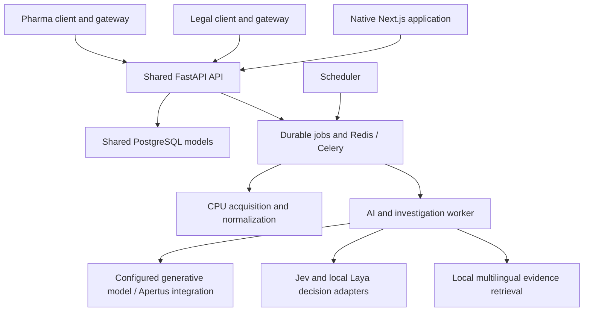

# Current architecture — repository audit

Audit date: 28 September 2026. Phase 0 of the owner's
[Unified Target Architecture](../UNIFIED_TARGET_ARCHITECTURE_SPEC.md).
This describes inspected code, not completion of the target architecture.

## Evidence boundary

| Repository | Audited main commit | Role |
|---|---|---|
| HappyMiha/helvetic-lens | `daf585976b3e55a54d58c4b70cb30d5e03a073c3` | Shared API, persistence, workers and native web application |
| HappyMiha/helveticlens-pharma | `d5d1145655dc4883b5317365efd7480ce45c1be2` | Pharma client and restricted API gateway |
| HappyMiha/helveticlens-legal | `075847285e65910e23bb3ec3540542803c3e6093` | Legal client and restricted API gateway |

All three were freshly fetched and clean at inspection. The supplied document is
preserved byte-for-byte; SHA-256:
`f5cb4d2218f377b317295b26c75c0c3eef2130c0624de668ded1c5308ecf048a`.
The second attachment has identical bytes. This audit used source, schemas,
existing test bodies/names and prior release evidence; it did not inspect private
production dossiers, invoke paid providers or perform browser acceptance.
[Release 1.28](../product-releases/2026-09-28-1.28.0.json) remains historical
production evidence, not proof that new target requirements are implemented.
The [audit receipt](audit-evidence.json) records inspected source hashes, model
fields, client parity and documentation checks for this baseline.

## Actual deployment and ownership

[compose.production.yaml](../../compose.production.yaml),
[jobs.py](../../services/api/helvetic_lens/jobs.py) and
[celery_app.py](../../services/api/helvetic_lens/celery_app.py) are the existing
deployment/job foundation. There are no separate Pharma and Legal databases or
investigation engines in the inspected product implementation. Separate client
repositories/deployments are an existing distribution choice; they are not a
reason to create separate domain services.

## Dossier and access

[ProductDossier](../../services/api/helvetic_lens/product_models.py) stores product,
organization, profile reference, work context, revisions and team settings.
[product_api.py](../../services/api/helvetic_lens/product_api.py) uses the same
creation/read routes and models for both products. Title, goal, topics, source
selection and profile status live in
[LegalMonitoringProfile / ProfileConfig](../../services/api/helvetic_lens/legal_profiles.py).
`ProductDossier.profile_id` is a unique foreign key to that legacy profile table.
There is no persisted DomainPack identity/version or formal template contract.

`context_json` exists, but
[product_operations.Context](../../services/api/helvetic_lens/product_operations.py)
strictly validates only `subject`, `reference`, `jurisdictions`, `category` strings.
It is not currently an arbitrary typed Legal/Pharma extension envelope.

[product_access.py](../../services/api/helvetic_lens/product_access.py),
[product_guest_access.py](../../services/api/helvetic_lens/product_guest_access.py)
and native auth implement ownership, current membership and
OWNER/EDITOR/CONTRIBUTOR/VIEWER roles. Public reading uses an explicitly authored
`ProductPublication` projection with revision history; it does not serialize the
private parent. See [product_publications.py](../../services/api/helvetic_lens/product_publications.py).
The target visibility enum must adapt this working security model, not replace
it with a public/private boolean. Organisation membership exists, but does not
establish completion of the target enterprise connector/audit mode.

The native application also has
[InfluenceDossier / InfluenceRevision / InfluenceReview](../../services/api/helvetic_lens/influence_models.py)
and legal document/comparison workflows. These are separate existing concepts.
One common implementation for Legal and Pharma already exists; unification of
all native/general dossier-like workflows does not. Preserve them during migration.

## Evidence, versions and structured memory

| Existing representation | What it actually retains |
|---|---|
| [Source, Law, DocumentWatch, Version](../../services/api/helvetic_lens/models.py) | Source identity, watched document, success/error state, original artifact, extracted text/passages, content hash and retained versions |
| [RegulatoryWork, RegulatoryExpression, RegulatoryDocumentVersion, RegulatoryDate](../../services/api/helvetic_lens/models.py) | Authority identity, language expression, version metadata, retained artifacts and typed source dates |
| [InvestigationSource](../../services/api/helvetic_lens/product_investigation_models.py) | Dossier/investigation-contained source snapshot, source key, URL, hash and evidence excerpts |
| [DossierEntry](../../services/api/helvetic_lens/product_models.py) | Notes, references, files, research and audit entries with actor/hash/artifact references |
| [DossierClaim and ClaimEvidence](../../services/api/helvetic_lens/product_investigation_models.py) | Persistent assertion, revision/history and scoped SUPPORTS/CONTRADICTS/CONTEXT links with exact quote/locator |
| [DossierEntity / DossierRelationship](../../services/api/helvetic_lens/product_investigation_models.py) | Investigation-contained entities and evidence-backed relations |
| [ClaimChange](../../services/api/helvetic_lens/product_investigation_models.py) | Cross-investigation CORROBORATES/CONTRADICTS/UPDATES links and active/dismissed editorial history |

Historical readers already exist in
[product_document_history.py](../../services/api/helvetic_lens/product_document_history.py)
and [law_history.py](../../services/api/helvetic_lens/law_history.py). They should
back a common evidence reference contract, not be replaced by another source store.

The product claim statuses are `UNVERIFIED`, `SUPPORTED`, `CONTESTED`,
`HYPOTHESIS`, `DISPROVED`, `SUPERSEDED`. They describe evidence state, not the
target human acceptance workflow. Claims do not yet have the target typed
subject/predicate/object, domain claim type, validity interval or a separate
human decision. A model-supported assertion must not be migrated to ACCEPTED.
Entities are scoped to investigations; persistent cross-run alias resolution is
not the same thing as extracting an entity into one run.

## Research, monitoring and review

[product_investigations.py](../../services/api/helvetic_lens/product_investigations.py)
and [product_investigation_worker.py](../../services/api/helvetic_lens/product_investigation_worker.py)
already persist plans, branches, checkpoints, generations and ordered events.
They enforce current access and bounded source/query budgets. This is an existing
research coordinator, not a blank orchestration project.

[product_monitoring_research.py](../../services/api/helvetic_lens/product_monitoring_research.py),
[product_page_research.py](../../services/api/helvetic_lens/product_page_research.py)
and [product_web_research.py](../../services/api/helvetic_lens/product_web_research.py)
connect native matches, saved page changes and recurring public questions to the
same engine. Policies and triggers retain scope, authority, revision and budget.
Unchanged retained evidence can skip repeated analysis. Native
[diffing.py](../../services/api/helvetic_lens/diffing.py) and saved comparisons are
deterministic foundations.

Coverage is present in several shapes: source capability contracts, selected-pack
[topic coverage](../../services/api/helvetic_lens/topic_coverage.py),
[watched-page health](../../services/api/helvetic_lens/product_sources.py), web
search lanes and investigation events. They do not form one durable per-dossier,
per-scan manifest. Unknown streams are counted in topic coverage; the target
requires identifiable unavailable sources, not only an aggregate gap count.

Review exists for accepted research answers, source decisions, evidence-change
links, work records and native monitoring matches. See
[product_answer_review.py](../../services/api/helvetic_lens/product_answer_review.py)
and [product_claim_evolution_api.py](../../services/api/helvetic_lens/product_claim_evolution_api.py).
`product_research.Finding` is a response schema, not a durable target Finding
table. `ClaimChange` review activates/dismisses a relationship; it does not
implement the complete Finding → Review → accepted Claim transition.

## Search and AI

| Existing path | Verified implementation boundary |
|---|---|
| [product_research.public_search](../../services/api/helvetic_lens/product_research.py) | Fedlex and Europe PMC searches; provider results are discovery, not proof of complete coverage |
| [decision_search.py](../../services/api/helvetic_lens/decision_search.py) | Google/Bing through Search1API, optional Pharma Europe PMC lane, deduplication, BM25 and reciprocal-rank fusion |
| [decision_engines.py](../../services/api/helvetic_lens/decision_engines.py) | Common typed System One choice contract; hosted Jev primary/local Laya fallback in auto mode; latency, usage and conditional cost estimates |
| [product_evidence_search.py](../../services/api/helvetic_lens/product_evidence_search.py) | Permission-filtered saved evidence, literal mode and local semantic decisions |
| [product_corpus_search.py](../../services/api/helvetic_lens/product_corpus_search.py) | Resumable whole-dossier local ranking/cache with source and claim identity checks |
| [evidence_embeddings.py](../../services/api/helvetic_lens/evidence_embeddings.py) | Pinned multilingual E5 small, 384 dimensions, explicit 20,000-record ceiling |
| [analysis.py](../../services/api/helvetic_lens/analysis.py) | Existing generative client and grounded analysis, including Apertus configuration; not a unified deterministic-first task router |
| [ai_capabilities.py](../../services/api/helvetic_lens/ai_capabilities.py) | Reviewed explanation-profile integrity/approval contracts; not a general domain Skill Registry |

Jev/Laya classify search strategy and candidate relevance. They do not fetch the
internet, establish truth or replace Apertus synthesis. Current decision search
chooses an engine before web retrieval; the target lookup/API-first routing is
therefore a migration requirement, not current behaviour. The native capability
gate must not be assumed to cover every product research model call.

The Laya deployment pins source and weights in [its deployment documentation](../../deploy/laya/README.md).
Its repository records Apache-2.0 upstream licensing; this audit did not re-audit
upstream licence terms or current hosted Jev terms/pricing. Existing contracts and
tests are evidence of integration; prior activation is distinct from fresh live
availability, measured professional accuracy or approval of a new task type.

## Frontend and domain coupling

Both clients use React/vinext, a restricted same-product gateway, the same
dossier/research components and separate Sites projects. Across tracked
`components/**/*.ts[x]` and `lib/**/*.ts[x]` paths, 153 are common and 152 are
byte-identical. Only `lib/product.ts` differs in that measured set. This includes
UI primitives; it is not a percentage of overall product reuse. The components
are copied source, not a published shared package. Native Next.js is a separate
shell with its own readers, auth and i18n contracts.

Shared client candidates include `workspace`, `wizard`, `investigation`,
`document-history`, `claim-evolution`, `transparency-panel`, `dossier-team`,
`universal-ask-search`, resource readers and the API gateway. The trust panel
explicitly says primary/secondary classification is not established.

Concrete coupling to address incrementally:

1. Both products depend on `LegalMonitoringProfile` and `legal_profiles.Input`.
2. `legal_profiles.suggest_topics` asks for legal topics even when reused by Pharma.
3. `product_investigations.capabilities` and `decision_search.federated_retrieve`
   branch directly on `product == "pharma"` for Europe PMC.
4. Product-specific fields/templates are currently client labels and examples.
5. Legal identity uses public `legal` and retained storage `loyer` through
   [ProductAliasMiddleware](../../services/api/helvetic_lens/product_identity.py).
6. The native regulatory corpus is intentionally Legal-specific; do not reinterpret
   its legal work-kind constraint as a general Pharma entity schema.

## Audit conclusions

Reuse the working dossier, authority, source-version, job and investigation
foundations. Formalize DomainPack at existing boundaries; do not introduce a
second engine or mechanically rename tables. Missing target capability is
tracked in [the gap analysis](core-gap-analysis.md), and proposed changes are
explicitly separated in [the target map](target-architecture.md).
