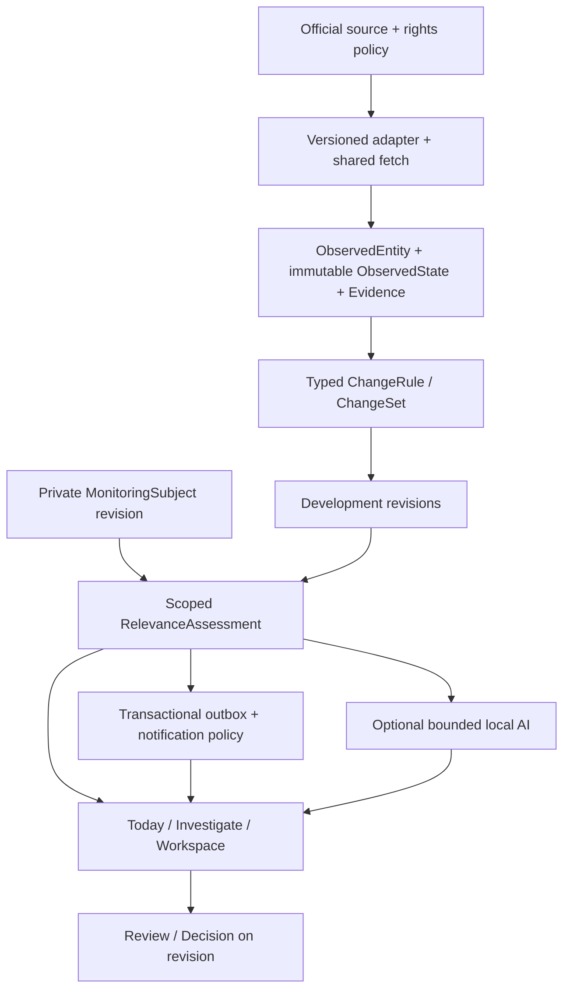

# Monitoring v2 — product and architecture decisions

**Development policy update, 12 September 2026:** One agent develops complete features on main and pushes origin/main. Both application instances keep isolated deployments, private data and source approvals. Any earlier separate-branch routing below is historical. See [the current development workflow](../DEVELOPMENT.md).

**Date:** 2026-09-10. **Status:** target architecture for implementation through the [single backlog](../../BACKLOG_MONITORING_V2.md). This document does not deliver v2 code. Baseline: `7109a28`; MVP snapshot: [v1.0.0-hackathon-mvp](https://github.com/HappyMiha/helvetic-lens/releases/tag/v1.0.0-hackathon-mvp).

**Product scope, unchanged in plan v1.6:** nine active scenarios C1/C2/C3/C5/C6/C7/B2/B7/B8. C4 is a possible future implementation following the user's decision of 2026-09-10; CURRENCY, Swiss Customs and customs-specific contracts are not being implemented now. Active scenarios require the generic kernel.

**Deployment channel:** `codex/HappyDucky02/monitoring-v2` targets its own instance on HappyDucky02 at monitoring.helveticlens.ch. Main-product and hackathon connector work continues through `main` on HappySnowman at helveticlens.ch. [MV2-072](../../BACKLOG_MONITORING_V2.md#mv2-072) owns the additional isolation and automatic-deployment acceptance; setup is in progress. This separation changes neither the modular application architecture below nor the Pollen Watch delivery order, and does not establish runtime readiness.

## Product analysis conclusion

The request expands monitoring from textual regulatory changes to official events, measurements and business opportunities. The shared user workflow stays the same: define an interest → receive a material change → check the reason/evidence → decide → continue monitoring.

The most valuable unit is a **development with retained history**, rather than a document or an individual scrape. A new tender, a postponed deadline and Q&A must therefore remain one tender development; a reviewed decision is bound to a specific revision. Commuters need train alerts that intersect their journey/service day/window. Environmental watches depend on metric, unit, station, time and quality, rather than a legal textual diff.

The strength of v2 is a controlled, source-backed cycle with shared delivery and history. The main product risks are a false impression of complete coverage, notification fatigue, unclear provenance of AI output, loss of an important revision after review, and mixing a private Home with an employer workspace.

Basic monitor creation does not require AI. Semantic assistance focuses on tender capabilities/gaps, trademark candidates/goods-services and unstructured auction descriptions. Numbers, source lifecycle, route/time matching and deadlines follow deterministic contracts. If AI is unapproved or unavailable, that state is visible and core monitoring continues.

## What actually exists

The [full static audit](BASELINE_AUDIT.md) provides baseline references. Key verified points:

| Existing capability | Limitation | Decision |
|---|---|---|
| [Organization/membership](../../services/api/helvetic_lens/models.py#L32) and personal workspace registration | A personal workspace does not establish the new private subject model | Reuse auth; owner-only personal workspace and explicit scope |
| [SourcePackDefinition/Subscription](../../services/api/helvetic_lens/models.py#L258) | Ten verified telemetry/business streams do not exist | Versioned capabilities/rights policy, source-specific adapters |
| [MonitoringTopic](../../services/api/helvetic_lens/models.py#L335) | Its plan primarily covers concepts/jurisdictions/languages/legal kinds | Typed subject/template configuration, bridge for Topics |
| [RegulatoryWork](../../services/api/helvetic_lens/models.py#L586), [RegulatoryEvent](../../services/api/helvetic_lens/models.py#L762) | Legal-only CHECK, work/version foreign keys | Additive generic entity/state/development; do not extend legal enums with arbitrary names |
| [OfficialConnector](../../services/api/helvetic_lens/connectors.py#L177) | Expression/artifact/relation interface | Parallel observation interface, shared transport/checkpoints |
| [InterestFeedReader](../../services/api/helvetic_lens/interest_feed.py#L49) | Groups around a regulatory event rather than a real-world development | Generic read projection and legacy compatibility |
| [ActionDecision](../../services/api/helvetic_lens/models.py#L1317) | Requires comparison and analysis | Generic decision independent of AI; preserve existing decisions |
| [Job](../../services/api/helvetic_lens/models.py#L1552), [OutboxMessage](../../services/api/helvetic_lens/models.py#L1609) | Do not themselves define source cadence and numeric semantics | Extend handlers/policy rather than building a new queue platform |

Table references correspond to `7109a28`; subsequent changes may shift line numbers. DONE labels in the old backlog indicate completion of its original scope, rather than automatic acceptance of new scenarios.

## ADR-1. Stack and boundaries

Keep one modular application: Next.js/Tailwind/shadcn, FastAPI, PostgreSQL, Redis/Celery, the existing artifact store and private local inference. Do not add ten services, a new identity system, a separate time-series cluster or a vector DB before establishing a need.

The generic kernel consists of modules within the current backend with type/schema contracts. PostGIS or another spatial mechanism is a decision for MV2-015, based on the required polygon/CRS operations and verified deployment; do not claim the extension already exists. JSON payloads are allowed for domain fields, but schema validation and indexed identity/time/metric/geography keys are mandatory. Not every conceptual noun requires a table.

Legal-only compare/registry/Ask remain a supported domain. An adapter bridge lets the new Today display them alongside v2 without rewriting the entire corpus history.

## ADR-2. Ownership and minimum contracts

| Contract | Required content | Scope / storage |
|---|---|---|
| MonitoringSubject | id, template_id, type, workspace_id, owner_scope, name, configuration, status, revision, actor/times | Private personal workspace or explicitly shared organization; reuse Topic revisions pattern |
| SourcePack / capability | dataset/stream, schema version, supported types/fields/geo/language/history, cadence, rights/access state, responsible operator | Shared catalogue; subscriptions/credentials bound to permitted scope |
| SourceConnection | provider reference, grant/expiry, checkpoints, last-success, run/errors, quota | Extension of existing ConnectorState/Schedule/Run rather than a second control plane |
| ObservedEntity | namespace, external_id, instance discriminator, entity_type, source provenance, aliases | Public sharing only for permitted public facts; access-gated data retains its scope |
| ObservedState | entity_id, schema/adapter revision, typed state, unit/aggregation, quality, source version, clocks, evidence_ref | Immutable; current pointer changes only according to ordering policy |
| ChangeSet | previous/current state refs, typed field changes, rule/evaluator version, material/nonmaterial, reason/inputs | Immutable evaluation result; separate no-change poll log |
| Development | identity/grouping policy/version, domain, scope, lifecycle, current_revision, related entities/states | A source incident may be shared; a user-threshold episode has private binding/scope |
| EvidenceBundle | authority/source/type/ID/URL, clocks, allowed snapshot/field/document references, content hashes, rights policy | Never infer permission from a public URL; verify the permitted representation |
| RelevanceAssessment | subject revision, development revision, rule, matched facts/reason params, method, exclusions, optional score/model | Tenant scoped; historical cause is not rewritten by a new profile |
| Review / Decision | actor, owner, comment, development_revision, status, timestamp, history | Personal opened/read state separate from shared review and decision |
| Deadline | explicit/calculated, source event/date, timezone/precision, rule/version, verification state, current revision | Rule audit; unknown stays unknown; scheduled reminders reference revision |
| NotificationRule / receipt | recipient, channel, priority, opt-in, quiet hours, mute/cooldown, revision, delivery key/status | Reuse preferences/outbox; recheck actor consent/current access |

All domain fields from the specification's state models are retained in [traceability](REQUIREMENTS_TRACEABILITY.md). Null is different from 0/false; unavailable, not-applicable and source-withheld have distinct reason codes. Ordinary users do not need to see technical fields.

## ADR-3. Identity, time and history

- Transport instance = provider trip identity + **service date**, with route/stop references from a versioned timetable. A trip with the same number tomorrow is a different instance.
- Environmental series = source/station/metric or allergen/pollutant + unit/basis + aggregation + observed/forecast. A forecast additionally has an issue time and target interval. Different products are not merged.
- Future C4 (DEFERRED, not a current implementation contract): customs series = authority/currency/nominal basis; a daily effective state and its correction are separate revisions. A material daily change has effective-date identity; corrections for that date update the same development. Overall rate history is grouped by series.
- Hazard/traffic incident = official ID + namespace; a planned closure occurrence differs from the road entity. Rescheduling preserves the occurrence if defined that way upstream.
- Tender dossiers and lots have official identifiers/aliases; publication language and document URL are not identity. Auction ≠ auction lot. Trademark ID takes precedence over a mutable owner/name.
- Numeric threshold episodes do not store a private user threshold in the public corpus. Private subject binding determines crossing/reset/reopen; reversal within an active episode retains its history, while a new crossing after reset creates the next episode linked to the series. Retrying the same state/rule revision does not create a new episode.
- Use UTC instants and IANA timezone for schedules; retain a source civil date as a date rather than inventing midnight. Intervals are half-open `[from,to)`; an overnight window crosses into the next day. Preview explicitly handles ambiguous/nonexistent DST input.
- Clocks: fetched_at, source_published_at, observed_at, effective_at, valid_from/until, detected_at; keep quality/releaseState/forecast issue clocks separate. A late fetch does not make an old source record the latest one.

Corrections and deletions are versioned source events. Disappearance from a partial feed does not prove cancellation. If a dataset has no history, a permitted local ledger begins at first ingestion; the UI does not promise earlier history that does not exist.

## ADR-4. Materiality and lifecycle

The first numeric state establishes a baseline without an invented delta. First receipt of a current official warning may deliver an initial active warning with the corresponding label; old backfill is not a "new hazard".

Use Decimal for numbers, unit/basis conversions and explicit display rounding. Percentage = `(current - baseline) / abs(baseline) × 100`; zero/missing baseline → not computable. A daily/weekly baseline is the previous effective period under source rules, rather than the previous poll. Strict `>` and `≥` differ. Hysteresis, minimum duration/cooldown/reset prevent values near a threshold from causing spam; a general noise rule must not suppress escalation/cancellation.

The specification's single vertical lifecycle mixes four axes. The implementation separates them:

| Axis | Example states | Changed by |
|---|---|---|
| Source lifecycle | ACTIVE / UPDATED / CANCELLED / RESOLVED / EXPIRED | Verified source event or explicitly labelled system expiry |
| Processing | DISCOVERED / EVALUATED / MATCHED / MATERIAL | Jobs/evaluator |
| Delivery / private read | QUEUED / SENT / FAILED / OPENED | Outbox/channel/user; SENT does not mean read |
| Review / decision | UNREVIEWED / REVIEWED / REOPENED + NO_ACTION/BID/etc. | Authorized user + reopening on a material revision |

A material update makes the reviewed-through revision outdated without deleting the owner/comment/previous decision. Source resolution closes the active source state even if the user has not opened it; decision history remains. Conflicting sources do not receive an artificial "average" state or an AI all-clear.

Cross-source MV2-036 provides explainable association rather than automatic causal inference. Until identity is verified, events are linked without irreversible merging. An audited split can preserve delivery/review histories.

## ADR-5. Source rights are part of the data contract

The [source dossier](SOURCE_FEASIBILITY.md) includes a date and primary references. Source policy includes permissions for ingestion, persistence, raw/derived UI/API/export, workspace sharing, alerts, publication_not_before, attribution, correction propagation, retention and grant expiry. The registry is versioned; policy applies to every output path, including support/log tooling.

Open XML/HTML does not automatically grant republication rights. C4 is deferred; separate verification of BAZG/SIX rights is required only if the user restores it to scope. No current work on those rights is scheduled. ASTRA derived fields and history require a verified policy; raw machine-readable export is not permitted under the reviewed terms. SIMAP originals remain separate from commentary, and timed publication/corrections are enforced in outbox/read paths. Clarify the scope of IPI mailings before email distribution.

The evidence contract permits **raw or normalized** snapshots, as required. If rights do not permit sufficient retained evidence for an AC, the case is BLOCKED; an official link alone does not satisfy restoration of a previous state. Protected tender attachments are not copied into a shared public corpus; public search access does not equal document access. Manual interest declaration/credentials/user account are required through a supported, permitted flow; otherwise attachment coverage remains incomplete.

## ADR-6. Matching, AI and decisions

Structured reasons consist of reason_code + params + matched fields + source anchors + subject/rule revision. AI may explain delivery but cannot be its sole reason. Preserve negative outcomes/sampled rejected candidates for recall audits without retaining unnecessary private data.

Business ranking: hard filters/exclusions → bounded lexical candidate set → similarity/optional semantic model → cited explanation. Unknown qualification = gap not proven; the example user score of 70 does not imply "70% probability". Marks require exact/lexical/phonetic matching and goods/services comparison rather than a legal conclusion.

Cache AI output by source state/profile/prompt/model/locale revisions. The model does not invent a legal deadline rule; an unsupported date stays unknown. Independent gold sets and a supported task×language profile are required. Existing legal-only prompts do not apply to transport/numeric facts. If the model queue is busy, feed/review/delivery continue with deterministic reasons.

BID/NO_BID/INSPECT/ESCALATE are internal decision states. Tender submission, auction bids, official declarations of interest, counsel email/filing are not performed automatically. Environmental guidance does not change treatment, and hazard instructions come from the authority without being replaced by a Marvin joke.

## ADR-7. Migration and backward compatibility

1. Baseline characterization: scripts/fixtures for existing laws/topics/watch, auth/roles, source packs/Basel, comparisons/citations/AI histories, unread/preferences and deep links.
2. Additive schema/API behind feature flags; do not delete old handlers or CHECK constraints. Reuse existing SourceConnection/Job/Outbox.
3. Resumable idempotent bridge with old ID mapping and versioned evidence; old records do not become new notifications. Access-gated references remain scoped.
4. Shadow-read comparisons on representative persisted data; document corrections, guard against duplicate dual fan-out; mutable feature flags have a safe fallback.
5. Per-template/per-workspace rollout; old URLs, evidence and workflows continue to work. Repairing old artifacts creates a new normalization revision without overwriting originals.
6. Isolated upgrade/restart/backfill/rollback restore rehearsal with row/hash/state checks; only then proceed to production rollout under separate authorization.

The v1 source tag is frozen code rather than a backup of the actual database, secrets, model files or built images. After new schema/data writes, checking out v1 in production is not sufficient rollback.

## ADR-8. Operational boundaries and acceptance

Shared source fetch and bounded fan-out; no per-user polling. Fair queues: deterministic urgent > bulk/history/AI; respect provider rate limits. User-visible freshness measures source publication/observation, rather than only a successful HTTP200. ASTRA revocation windows, GTFS full/differential feed and FOEN live history window belong in tests instead of being inferred from generic expiry.

Retain permitted state/evidence for every delivered revision; uninteresting raw telemetry may be compacted under source policy, while preserving old/current proof and decisions. P95/capacity budgets, five-language review and pilot sample targets are proposed in the backlog; no baseline runtime success is claimed here.

**First complete delivery — Pollen Watch.** The explicit path MV2-001 → MV2-069 → MV2-070 → MV2-030 → MV2-031 → MV2-071 isolates C5 from shared source/UI/privacy/ops parent tasks while preserving generic contracts. MV2-069 separately verifies observation and forecast; MV2-070 implements the C5 shared-platform subset; MV2-071 accepts the complete scenario for testing with people. It does not depend on all-domain UI, business AI or the full-v2 pilot; full parent AC and MV2-058 remain open. The first usability wave with ≥5 B2C participants is a separate early protocol rather than proven overall KPIs.

C4 is excluded from current development, source-rights work, pilot and release gates. Nine active cases and 116 active AC must have source-to-decision evidence before release 2.0; 10 AC-C4 remain DEFERRED. Partial previews are explicitly labelled. Final go/no-go belongs to MV2-059 after MV2-057/058 and any open inherited gates.

## Decisions to refine before the corresponding implementation

| Question | Current planned decision | Closed in |
|---|---|---|
| Exact supported stations/regions/transport coverage | Show only verified capabilities; the Lugano example does not prove availability of every parameter | MV2-003,015 and each adapter; do not remove the core scenario |
| Source rights/account/cost | Do not accept terms or purchase access while writing the plan; G(case) is mandatory | MV2-028/038/040/042/046/049 |
| Hysteresis/rapid increase/cooldown parameters | Versioned template defaults after domain/UX checks; user overrides within schema | MV2-008, domain workflows |
| Geo library / spatial DB extension | Minimum mechanism that passes boundary/CRS/performance checks | MV2-015/054 |
| AI model and thresholds | Preserve local-first; promote only a measured per-task/per-language profile | MV2-051/054 |
| Human reviewers / pilot participants | Roles and minimum samples are defined; specific people are not yet assigned | MV2-002/024/051/058 |
| Release cadence / staffing / dates | No invented calendar; refine after source dossiers and refinement of L tasks | MV2-001/003/059 |
