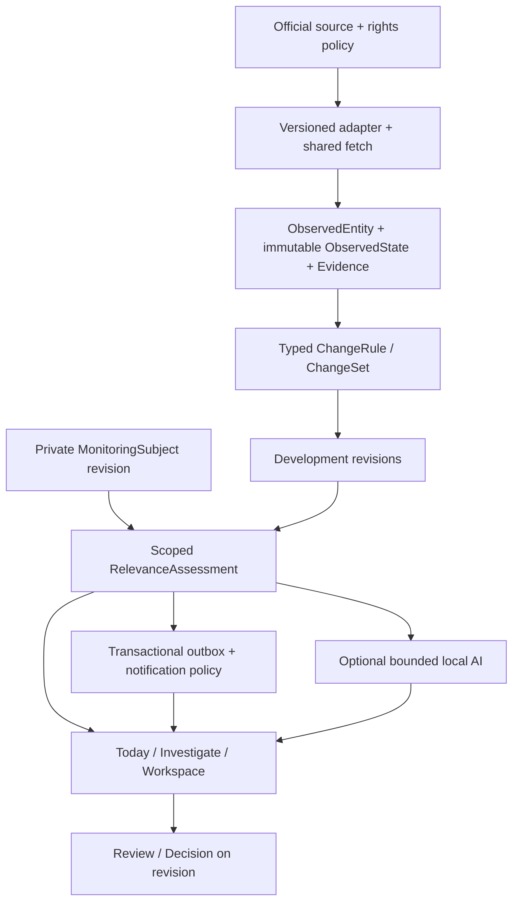

# Monitoring v2 — продуктове й архітектурне рішення

**Дата:** 2026-09-10. **Стан:** цільова архітектура для реалізації за [єдиним беклогом](../../BACKLOG_MONITORING_V2.md). Код v2 цим документом не поставлено. Baseline: `7109a28`; snapshot MVP: [v1.0.0-hackathon-mvp](https://github.com/HappyMiha/helvetic-lens/releases/tag/v1.0.0-hackathon-mvp).

## Висновок продуктового аналізу

Запит розширює предмет моніторингу від текстових regulatory changes до офіційних подій, вимірювань і бізнес-можливостей. Спільна робота користувача не змінюється: визначити інтерес → отримати матеріальну зміну → перевірити причину/доказ → ухвалити рішення → відстежувати далі.

Найцінніша одиниця — **development зі збереженою історією**, а не документ або окремий scrape. Тому новий тендер, перенесений deadline і Q&A повинні лишатися одним tender development; переглянуте рішення прив’язується до конкретної revision. Для commuter важливий не будь-який train alert, а перетин із його journey/service day/window. Для environmental watch важливі metric, unit, station, time і quality, а не юридичний textual diff.

Сила v2 — не десять вкладок із різними сайтами. Це керований source-backed цикл із спільною доставкою та історією. Головні продуктові ризики: хибне відчуття повного покриття, notification fatigue, неочевидне походження AI-результату, втрата важливої revision після review та змішування приватного Home з employer workspace.

Базове створення monitors не потребує AI. Semantic assistance зосереджена на tender capabilities/gaps, trademark candidates/goods-services та unstructured auction description. Числа, source lifecycle, route/time match і deadlines обчислюються deterministic contracts. Якщо AI не схвалений чи недоступний, це видно, а core monitoring працює.

## Що є насправді

[Повний статичний аудит](BASELINE_AUDIT.md) містить прив’язки до baseline. Ключові підтверджені точки:

| Вже є | Обмеження | Рішення |
|---|---|---|
| [Organization/membership](../../services/api/helvetic_lens/models.py#L32) і personal workspace registration | Особистий workspace не означає нову private subject model | Reuse auth; owner-only personal workspace і explicit scope |
| [SourcePackDefinition/Subscription](../../services/api/helvetic_lens/models.py#L258) | Немає десяти підтверджених telemetry/business streams | Versioned capabilities/rights policy, source-specific adapters |
| [MonitoringTopic](../../services/api/helvetic_lens/models.py#L335) | Plan переважно concepts/jurisdictions/languages/legal kinds | Typed subject/template configuration, bridge для Topics |
| [RegulatoryWork](../../services/api/helvetic_lens/models.py#L586), [RegulatoryEvent](../../services/api/helvetic_lens/models.py#L762) | Legal-only CHECK, work/version foreign keys | Additive generic entity/state/development; не розширювати legal enums довільними назвами |
| [OfficialConnector](../../services/api/helvetic_lens/connectors.py#L177) | Expression/artifact/relation interface | Parallel observation interface, shared transport/checkpoints |
| [InterestFeedReader](../../services/api/helvetic_lens/interest_feed.py#L49) | Групування навколо regulatory event, не real-world development | Generic read projection і legacy compatibility |
| [ActionDecision](../../services/api/helvetic_lens/models.py#L1317) | Потребує comparison і analysis | Generic decision незалежно від AI; старі рішення зберегти |
| [Job](../../services/api/helvetic_lens/models.py#L1552), [OutboxMessage](../../services/api/helvetic_lens/models.py#L1609) | Не задають самі source cadence і numeric semantics | Розширити handlers/policy, не будувати нову queue platform |

Посилання в таблиці відповідають `7109a28`; наступні зміни можуть змістити рядки. Позначки DONE старого беклогу означають зроблений тодішній scope, а не автоматичне приймання нових сценаріїв.

## ADR-1. Стек і межі

Лишається один модульний застосунок: Next.js/Tailwind/shadcn, FastAPI, PostgreSQL, Redis/Celery, чинний artifact store й private local inference. Не додаємо десять сервісів, нову identity system, окремий time-series cluster або vector DB до доведеної потреби.

Generic kernel — модулі всередині current backend із type/schema contracts. PostGIS або інший spatial механізм — рішення MV2-015 на основі потрібних polygon/CRS операцій і перевіреного deployment; extension не слід оголошувати вже наявним. JSON payload дозволений для domain fields, але schema validation і індексовані identity/time/metric/geography keys обов’язкові. Не кожний conceptual noun потребує таблиці.

Legal-only compare/registry/Ask лишаються підтриманим доменом. Adapter bridge дозволяє новому Today показувати їх разом із v2, без rewrite усієї corpus history.

## ADR-2. Власність і мінімальні контракти

| Контракт | Обов’язковий зміст | Scope / зберігання |
|---|---|---|
| MonitoringSubject | id, template_id, type, workspace_id, owner_scope, name, configuration, status, revision, actor/times | Private personal workspace або explicit shared organization; reuse Topic revisions pattern |
| SourcePack / capability | dataset/stream, schema version, supported types/fields/geo/language/history, cadence, rights/access state, responsible operator | Shared catalogue; subscriptions/credentials прив’язані до дозволеного scope |
| SourceConnection | provider reference, grant/expiry, checkpoints, last-success, run/errors, quota | Розширення наявного ConnectorState/Schedule/Run, не другий control plane |
| ObservedEntity | namespace, external_id, instance discriminator, entity_type, source provenance, aliases | Public shared тільки для дозволених public facts; access-gated data зберігає scope |
| ObservedState | entity_id, schema/adapter revision, typed state, unit/aggregation, quality, source version, clocks, evidence_ref | Immutable; current pointer змінюється лише після ordering policy |
| ChangeSet | previous/current state refs, typed field changes, rule/evaluator version, material/nonmaterial, reason/inputs | Immutable evaluation result; no-change poll log окремо |
| Development | identity/grouping policy/version, domain, scope, lifecycle, current_revision, related entities/states | Source incident може бути shared; user-threshold episode — private binding/scope |
| EvidenceBundle | authority/source/type/ID/URL, clocks, allowed snapshot/field/document references, content hashes, rights policy | Never infer permission from public URL; дозволена representation перевірена |
| RelevanceAssessment | subject revision, development revision, rule, matched facts/reason params, method, exclusions, optional score/model | Tenant scoped; historical cause not rewritten by new profile |
| Review / Decision | actor, owner, comment, development_revision, status, timestamp, history | Personal opened/read окремо від спільного review і decision |
| Deadline | explicit/calculated, source event/date, timezone/precision, rule/version, verification state, current revision | Rule audit; unknown stays unknown; scheduled reminders reference revision |
| NotificationRule / receipt | recipient, channel, priority, opt-in, quiet hours, mute/cooldown, revision, delivery key/status | Reuse preferences/outbox; actor consent/current access rechecked |

Усі domain fields зі state models специфікації збережені в [traceability](REQUIREMENTS_TRACEABILITY.md). Null означає не те саме, що0/false; unavailable, not-applicable і source-withheld мають різні reason codes. Технічні fields не потрібно показувати пересічному користувачеві.

## ADR-3. Ідентичність, час та історія

- Transport instance = provider trip identity + **service date**, route/stop references з versioned timetable. Trip з таким самим номером завтра — інший екземпляр.
- Environmental series = source/station/metric або allergen/pollutant + unit/basis + aggregation + observed/forecast. Forecast додатково має issue time і target interval. Різні продукти не зливаються.
- Customs series = authority/currency/nominal basis; daily effective state і його correction окремі revisions. Material daily change має effective-date identity; corrections цієї дати оновлюють той самий development. Загальна rate history об’єднується за series.
- Hazard/traffic incident = official ID + namespace; planned closure occurrence відрізняється від road entity. Rescheduling зберігає occurrence, якщо так визначено upstream.
- Tender dossier і lots мають офіційні identifiers/aliases; publication language і document URL не є identity. Auction ≠ auction lot. Trademark ID важливіший за змінюваний owner/name.
- Numeric threshold episodes не зберігають приватний user threshold у public corpus. Private subject binding визначає crossing/reset/reopen; reversal в активному episode лишає його історію, нове crossing після reset створює наступний episode, пов’язаний із series. Retry тієї самої state/rule revision не створює новий episode.
- UTC instants і IANA timezone для schedule; source civil date зберігається як date, а не вигадана опівніч. Intervals half-open `[from,to)`; overnight window перетинає наступний день. DST ambiguous/nonexistent input явно обробляється preview.
- Clocks: fetched_at, source_published_at, observed_at, effective_at, valid_from/until, detected_at; quality/releaseState/forecast issue clocks окремі. Пізній fetch не робить старий source record найновішим.

Correction і deletion — versioned source events. Зникнення з partial feed не доводить cancellation. Якщо dataset не має історії, локальна дозволена ledger починається від first ingestion; UI не обіцяє попередню історію, якої немає.

## ADR-4. Materiality і lifecycle

Перший числовий стан створює baseline без invented delta. Перше отримання чинного офіційного warning може бути initial active warning delivery з відповідним label; старий backfill не є «новою небезпекою».

Для чисел використовувати Decimal, unit/basis conversions і explicit rounding for display. Percentage = `(current - baseline) / abs(baseline) × 100`; zero/missing baseline → not computable. Daily/weekly baseline — попереднє effective period за правилами source, не попередній poll. Strict `>` і `≥` різні. Hysteresis, minimum duration/cooldown/reset потрібні, щоб значення біля порога не спамило; escalation/cancellation не пригнічується загальним шумовим правилом.

У специфікації одна вертикальна lifecycle змішує чотири осі. Реалізація розділяє їх:

| Вісь | Приклади станів | Хто змінює |
|---|---|---|
| Source lifecycle | ACTIVE / UPDATED / CANCELLED / RESOLVED / EXPIRED | Підтверджений source event або явно позначений system expiry |
| Processing | DISCOVERED / EVALUATED / MATCHED / MATERIAL | Jobs/evaluator |
| Delivery / private read | QUEUED / SENT / FAILED / OPENED | Outbox/channel/user; SENT не означає read |
| Review / decision | UNREVIEWED / REVIEWED / REOPENED + NO_ACTION/BID/etc. | Authorized user + material revision re-open |

Material update робить reviewed-through revision застарілою, але не видаляє owner/comment/попередню decision. Source resolution закриває active source state навіть без відкриття користувачем; decision history залишається. Conflicting sources не отримують штучний «середній» стан або AI all-clear.

Cross-source MV2-036 — explainable association, а не автоматична causal inference. До підтвердження identity події зв’язані, але не безповоротно злиті. Можливий audited split із збереженням delivery/review histories.

## ADR-5. Права джерел — частина data contract

[source dossier](SOURCE_FEASIBILITY.md) має дату й первинні посилання. Source policy включає дозволи ingestion, persistence, raw/derived UI/API/export, workspace sharing, alerts, publication_not_before, attribution, correction propagation, retention, grant expiry. Registry versioned; policy застосовується до всіх output paths, включно з support/log tooling.

Відкритий XML/HTML не дає автоматичного права на перевидання. Для C4 запуск неможливий до підтверджених прав BAZG/SIX. Для ASTRA derived fields і history потребують verified policy; raw machine-readable export не дозволяється за перевіреними умовами. SIMAP originals не змішуються з коментарями, timed publication і corrections виконуються в outbox/read path. IPI mailings scope треба уточнити до email distribution.

Evidence contract допускає **raw або normalized** snapshots, як у вимогах. Якщо rights не дозволяють sufficient retained evidence для AC, цей кейс BLOCKED; official link сам по собі не закриває вимогу відновити попередній стан. Protected tender attachments не копіюються у shared public corpus; public search access не дорівнює document access. Manual interest declaration/credentials/user account потрібні за підтриманим дозволеним flow, інакше attachment coverage incomplete.

## ADR-6. Matching, AI та рішення

Structured reasons — reason_code + params + matched fields + source anchors + subject/rule revision. AI може пояснювати, але не бути єдиною причиною доставки. Preserve negative outcomes/sampled rejected candidates для recall audit без збереження зайвих приватних даних.

Business ranking: hard filters/exclusions → bounded lexical candidate set → similarity/optional semantic model → cited explanation. Unknown qualification = gap not proven; user score70 з прикладу не вмикає «70% probability». Для marks потрібні exact/lexical/phonetic і goods/services, а не legal conclusion.

AI output кешується за source state/profile/prompt/model/locale revisions. Модель не формує legal deadline rule сама; unsupported date лишається unknown. Потрібні independent gold sets та supported task×language profile. Збережені legal-only prompts не застосовуються до transport/numeric facts. Якщо model queue зайнята, feed/review/delivery працюють із deterministic reasons.

BID/NO_BID/INSPECT/ESCALATE — внутрішні decision states. Tender submission, auction bid, official declaration of interest, counsel email/filing не виконуються автоматично. Підказки environmental cases не змінюють лікування, а hazard instructions походять від органу й не підміняються жартом Marvin.

## ADR-7. Міграція й зворотна сумісність

1. Baseline characterization: scripts/fixtures для existing laws/topics/watch, auth/roles, source packs/Basel, comparisons/citations/AI histories, unread/preferences, deep links.
2. Additive schema/API за feature flags; старі handlers і CHECK constraints не видаляються. Existing SourceConnection/Job/Outbox перевикористовуються.
3. Resumable idempotent bridge із old ID mapping і versioned evidence; старі records не стають новими notifications. Access-gated references лишаються scoped.
4. Shadow-read comparisons на representative persisted data; поправки documented, dual fan-out duplicate guard; mutable feature flags мають safe fallback.
5. Per-template/per-workspace rollout; old URLs, evidence і workflows працюють. Виправлення старих артефактів — нова normalization revision, без overwrite originals.
6. Isolated upgrade/restart/backfill/rollback restore rehearsal з row/hash/state checks; лише після цього production rollout за окремою авторизацією.

v1 source tag — зафіксований код, а не backup реальної БД, secrets, model files чи built images. Після нових schema/data writes не можна просто checkout v1 на production і назвати це rollback.

## ADR-8. Операційні межі та приймання

Shared source fetch і bounded fan-out; ніякого polling на кожного користувача. Fair queues: deterministic urgent > bulk/history/AI; provider rate limits поважаються. User-visible freshness вимірює source publication/observation, не тільки успішний HTTP200. ASTRA revocation windows, GTFS full/differential feed і FOEN live history window входять у tests, а не inferred generic expiry.

Retain дозволені state/evidence для всіх delivered revisions; uninteresting raw telemetry можна compact за source policy, але old/current proof і decisions не губляться. P95/capacity budgets, five-language review і pilot sample targets — запропоновані в беклозі; baseline runtime success тут не заявляється.

Перший slice — C5; C4 не відкидається, але source-rights path ведеться паралельно. Десять кейсів повинні мати source-to-decision evidence до release2.0. Часткові previews явно так позначаються. Остаточний go/no-go належить MV2-059 після MV2-057/058 і незакритих inherited gates.

## Рішення, які уточнюються перед відповідною реалізацією

| Питання | Планове рішення зараз | Де закривається |
|---|---|---|
| Supported exact stations/regions/transport coverage | Показувати тільки verified capabilities; приклад Lugano не доводить доступність кожного параметра | MV2-003,015 та кожний adapter; core scenario не вилучається |
| Source rights/account/cost | Не приймати terms і не купувати доступ у ході написання плану; G(case) обов’язковий | MV2-026/028/038/040/042/046/049 |
| Параметри hysteresis/rapid increase/cooldown | Версійні template defaults після domain/UX checks; user overrides у межах schema | MV2-008, доменні workflows |
| Geo library / spatial DB extension | Мінімальний механізм, що проходить boundary/CRS/performance checks | MV2-015/054 |
| AI модель і thresholds | Зберегти local-first; promote тільки measured per-task/per-language profile | MV2-051/054 |
| Human reviewers / pilot participants | Ролі й мінімальні samples задані, конкретні люди ще не призначені | MV2-002/024/051/058 |
| Release cadence / staffing / dates | Без вигаданого календаря; уточнити після source dossiers і refinement L tasks | MV2-001/003/059 |
